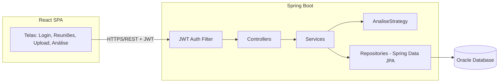
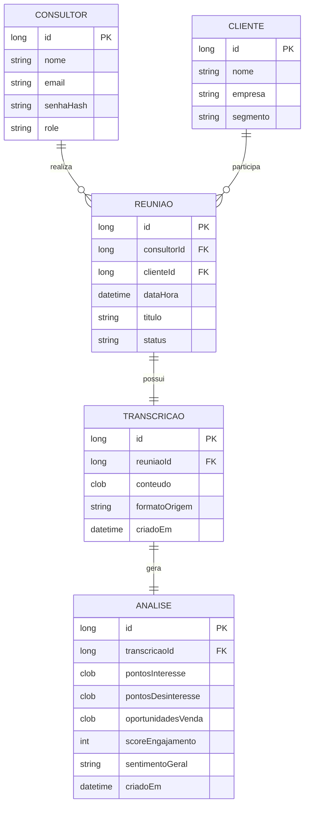

# Documento de Design de Software (SDD) — InsightCall

**Versão:** 1.0
**Autor:** Kelwin Silva Bastos
**Data:** 04/09/2026
**Contexto:** Challenge TOTVS 2026 — FIAP

---

## 1. Introdução

### 1.1 Objetivo
Este documento descreve a arquitetura, o modelo de dados e as decisões técnicas do **InsightCall**, uma plataforma web para armazenamento de transcrições de reuniões por consultor e análise automática do conteúdo, identificando pontos de interesse, desinteresse e oportunidades de venda.

### 1.2 Problema de negócio
Consultores realizam diversas reuniões com clientes e, hoje, a transcrição dessas conversas fica dispersa (arquivos soltos, e-mails, etc.), sem padronização e sem nenhuma extração de insight. Isso gera perda de informação comercial relevante e retrabalho para relembrar o que foi discutido.

### 1.3 Restrições do projeto
| Restrição | Impacto no design |
|---|---|
| Prazo de 10 dias, 1 desenvolvedor | MVP enxuto, sem funcionalidades acessórias |
| ~42h efetivas de desenvolvimento | Análise de texto **rule-based**, não ML |
| Stack fixa: Spring Boot, Spring Data, JWT, Oracle, React | Sem espaço para testar stacks alternativas |
| Apresentação para a TOTVS | Precisa de uma demo estável, mesmo que com dados de seed |

---

## 2. Requisitos

### 2.1 Requisitos Funcionais (RF)

| ID | Descrição | Prioridade (MoSCoW) |
|---|---|---|
| RF01 | Consultor deve poder se cadastrar e fazer login (JWT) | Must |
| RF02 | Consultor deve poder cadastrar um cliente e uma reunião | Must |
| RF03 | Consultor deve poder enviar (upload/colar) a transcrição de uma reunião | Must |
| RF04 | Sistema deve processar a transcrição e gerar uma análise (interesse, desinteresse, oportunidades, score) | Must |
| RF05 | Consultor deve poder visualizar o resultado da análise de uma reunião | Must |
| RF06 | Consultor deve poder listar/filtrar suas próprias reuniões e transcrições | Should |
| RF07 | Sistema deve permitir reprocessar uma análise | Could |
| RF08 | Painel resumido com contagem de reuniões e oportunidades identificadas | Could |
| RF09 | Papel ADMIN capaz de ver reuniões de todos os consultores | Won't (nesta entrega) |

### 2.2 Requisitos Não Funcionais (RNF)

| ID | Descrição |
|---|---|
| RNF01 | Autenticação stateless via JWT, senha com hash BCrypt |
| RNF02 | Análise de uma transcrição de até ~10 mil caracteres deve responder em menos de 3s (processamento síncrono) |
| RNF03 | Ambiente de banco reproduzível via Docker (Oracle XE) |
| RNF04 | Código organizado em camadas, com motor de análise desacoplado (Strategy) para permitir troca futura por NLP/LLM sem alterar o restante do sistema |
| RNF05 | API documentada via OpenAPI/Swagger para facilitar integração com o frontend e a avaliação da banca |

---

## 3. Arquitetura

### 3.1 Visão geral



### 3.2 Justificativa arquitetural
Optou-se por um **monolito modular em camadas** em vez de microsserviços: com um único desenvolvedor e 10 dias, a complexidade operacional de múltiplos serviços (deploy, comunicação, observabilidade) não se paga. A separação em pacotes (`controller`, `service`, `repository`, `service.analise`) já garante baixo acoplamento suficiente para a apresentação e para evolução futura.

### 3.3 Camadas

- **Controller**: expõe os endpoints REST, valida entrada (Bean Validation) e traduz para DTOs.
- **Service**: contém a regra de negócio (ex: `TranscricaoService`, `AnaliseService`, `AuthService`).
- **Strategy de análise** (`service.analise`): interface `AnaliseStrategy` com implementação `KeywordAnaliseStrategy`. Permite trocar a lógica de análise (hoje regex/keywords, amanhã um LLM) sem tocar no restante da aplicação.
- **Repository**: interfaces Spring Data JPA sobre as entidades.
- **Security**: filtro JWT, `UserDetailsService`, configuração de rotas públicas/privadas.

---

## 4. Modelo de dados

### 4.1 Entidades principais



### 4.2 Observações de modelagem
- `TRANSCRICAO.conteudo` e os campos de `ANALISE` usam **CLOB** por serem textos longos, compatível com Oracle.
- `STATUS` de `REUNIAO` como enum: `AGENDADA`, `REALIZADA`, `ANALISADA`.
- `pontosInteresse`, `pontosDesinteresse` e `oportunidadesVenda` são armazenados como JSON serializado dentro do CLOB (lista de strings), evitando tabelas extras para o MVP.

---

## 5. Design da API REST

| Método | Endpoint | Descrição | Autenticação |
|---|---|---|---|
| POST | `/api/auth/register` | Cadastro de consultor | Pública |
| POST | `/api/auth/login` | Login, retorna JWT | Pública |
| GET | `/api/clientes` | Lista clientes | JWT |
| POST | `/api/clientes` | Cria cliente | JWT |
| GET | `/api/reunioes` | Lista reuniões do consultor logado | JWT |
| POST | `/api/reunioes` | Cria reunião | JWT |
| POST | `/api/reunioes/{id}/transcricao` | Envia transcrição de uma reunião | JWT |
| POST | `/api/transcricoes/{id}/analisar` | Dispara a análise da transcrição | JWT |
| GET | `/api/transcricoes/{id}/analise` | Consulta resultado da análise | JWT |
| GET | `/api/dashboard/resumo` | Métricas resumidas do consultor | JWT |

---

## 6. Segurança

- Autenticação **stateless** via JWT (sem sessão em servidor).
- Fluxo: login → gera token assinado (HMAC) com `sub` (email), `role` e expiração → cliente envia `Authorization: Bearer <token>` em cada request → `JwtAuthFilter` valida assinatura/expiração e popula o `SecurityContext`.
- Senhas armazenadas com **BCrypt**.
- Endpoints `/api/auth/**` públicos; todo o restante exige token válido.
- CORS liberado apenas para a origem do frontend (`localhost:5173` em dev).

---

## 7. Motor de análise (detalhamento)

### 7.1 Interface

```java
public interface AnaliseStrategy {
    ResultadoAnalise analisar(String textoTranscricao);
}
```

### 7.2 Implementação inicial — `KeywordAnaliseStrategy`
Abordagem **rule-based**, reaproveitando a lógica de detecção de palavras-chave e extração via regex já validada em projeto anterior (AUDIA/InsightCall — Challenge TOTVS):

- **Listas de palavras-chave** (PT-BR) por categoria, ex:
  - *Interesse*: "faz sentido", "quero saber mais", "quanto custa", "podemos avançar";
  - *Desinteresse*: "não é prioridade agora", "vamos pensar", "sem orçamento no momento";
  - *Oportunidade*: "outra filial", "módulo adicional", "renovação do contrato", "upgrade".
- **Regex** para capturar menções a valores monetários e prazos (ex: extração de orçamento citado em reunião).
- **Score de engajamento**: cálculo simples (ex: proporção de trechos positivos vs. negativos, normalizado de 0 a 100).
- Resultado devolvido como `ResultadoAnalise` (DTO), persistido pela `AnaliseService`.

### 7.3 Extensibilidade futura
Basta criar uma nova implementação (`LlmAnaliseStrategy`) e trocar o bean injetado — o restante do sistema (controller, persistência, frontend) não muda. Esse ponto vale a pena destacar na apresentação para a TOTVS como diferencial de design.

---

## 8. Decisões técnicas e trade-offs

| Decisão | Alternativa considerada | Motivo da escolha |
|---|---|---|
| Análise rule-based (regex/keywords) | Modelo de NLP/LLM real | Prazo de 10 dias não permite integração + testes de um modelo com confiabilidade |
| Oracle XE via Docker | Oracle Cloud Free Tier | Setup mais rápido e sem dependência de internet/latência durante o desenvolvimento |
| Processamento síncrono da análise | Processamento assíncrono (fila) | Volume da demo é baixo; complexidade de fila não se justifica no MVP |
| Monolito modular | Microsserviços | Overhead de infraestrutura incompatível com 1 dev / 10 dias |
| JSON dentro de CLOB para listas de insights | Tabelas normalizadas (ex: `PONTO_INTERESSE`) | Reduz número de entidades/joins para o prazo disponível |

---

## 9. Riscos e mitigação

| Risco | Probabilidade | Mitigação |
|---|---|---|
| Setup do Oracle consumir tempo demais | Média | Resolver Docker do Oracle já no Sprint 0 (antes do fim de semana 1) |
| JWT mal configurado gerar bugs de autenticação | Baixa | Reaproveitar implementação já validada em projetos anteriores |
| Escopo aumentar durante o desenvolvimento | Alta | Lista de RF com MoSCoW travada; qualquer item novo vira "Won't" nesta entrega |
| Falta de tempo para o frontend | Média | Frontend com no máximo 4 telas (login, reuniões, upload, resultado da análise) |

---

## 10. Plano de testes (mínimo viável)

- Testes unitários (JUnit + Mockito) para:
  - `AuthService` (login/registro, geração de token);
  - `KeywordAnaliseStrategy` (classificação correta de trechos de exemplo);
- Testes manuais via Swagger/Postman para os demais endpoints;
- Roteiro de demonstração com dados de *seed* (2–3 transcrições de exemplo já cadastradas) para garantir uma apresentação estável no dia 14/09.
