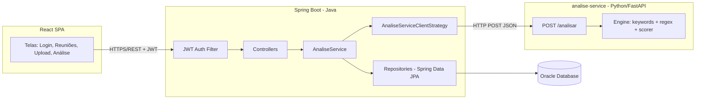
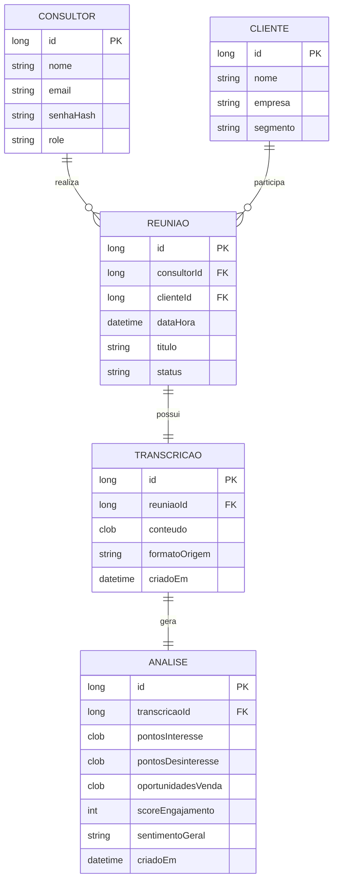

# Documento de Design de Software (SDD) — InsightCall

**Versão:** 1.0
**Autor:** Kelwin Silva Bastos
**Data:** 04/09/2026
**Contexto:** Challenge TOTVS 2026 — FIAP

---

## 1. Introdução

### 1.1 Objetivo
Este documento descreve a arquitetura, o modelo de dados e as decisões técnicas do **InsightCall**, uma plataforma web para armazenamento de transcrições de reuniões por consultor e análise automática do conteúdo, identificando pontos de interesse, desinteresse e oportunidades de venda.

### 1.2 Problema de negócio
Consultores realizam diversas reuniões com clientes e, hoje, a transcrição dessas conversas fica dispersa (arquivos soltos, e-mails, etc.), sem padronização e sem nenhuma extração de insight. Isso gera perda de informação comercial relevante e retrabalho para relembrar o que foi discutido.

### 1.3 Restrições do projeto
| Restrição | Impacto no design |
|---|---|
| Prazo até 15/10/2026, 2 desenvolvedores | Permite paralelizar backend Java e motor Python, desde que o contrato entre eles seja acordado cedo |
| Stack: Spring Boot, Spring Data, JWT, Oracle, React + Python/FastAPI | Dois runtimes distintos para subir e manter |
| Banco Oracle compartilhado da faculdade | Depende de rede/VPN da instituição; fora do controle da equipe |
| Apresentação para a TOTVS | Precisa de uma demo estável, com os **dois serviços** no ar simultaneamente |

---

## 2. Requisitos

### 2.1 Requisitos Funcionais (RF)

| ID | Descrição | Prioridade (MoSCoW) |
|---|---|---|
| RF01 | Consultor deve poder se cadastrar e fazer login (JWT) | Must |
| RF02 | Consultor deve poder cadastrar um cliente e uma reunião | Must |
| RF03 | Consultor deve poder enviar (upload/colar) a transcrição de uma reunião | Must |
| RF04 | Sistema deve processar a transcrição e gerar uma análise (interesse, desinteresse, oportunidades, score) | Must |
| RF05 | Consultor deve poder visualizar o resultado da análise de uma reunião | Must |
| RF06 | Consultor deve poder listar/filtrar suas próprias reuniões e transcrições | Should |
| RF07 | Sistema deve permitir reprocessar uma análise | Could |
| RF08 | Painel resumido com contagem de reuniões e oportunidades identificadas | Could |
| RF09 | Papel ADMIN capaz de ver reuniões de todos os consultores | Won't (nesta entrega) |

### 2.2 Requisitos Não Funcionais (RNF)

| ID | Descrição |
|---|---|
| RNF01 | Autenticação stateless via JWT, senha com hash BCrypt |
| RNF02 | Análise de uma transcrição de até ~10 mil caracteres deve responder em menos de 3s, incluindo o tempo da chamada HTTP entre os serviços |
| RNF03 | Conexão configurável via variáveis de ambiente com o servidor Oracle da faculdade (sem dependência de infraestrutura local de banco) |
| RNF04 | O motor de análise deve ser um serviço independente e **stateless**, permitindo evoluir a lógica de análise (regex → NLP/LLM) sem qualquer alteração no backend Java |
| RNF05 | Ambos os serviços documentados via OpenAPI/Swagger (springdoc no Java, nativo no FastAPI) |
| RNF06 | A indisponibilidade do serviço de análise **não pode derrubar** o restante da aplicação: login, CRUDs e upload de transcrição continuam funcionando; apenas a análise retorna erro tratado |

---

## 3. Arquitetura

### 3.1 Visão geral

O sistema é composto por **dois serviços independentes** mais o frontend. O backend Java é o orquestrador e único dono do banco; o serviço Python é especializado em processamento de texto e não tem estado nem acesso a dados.



**Fluxo completo de uma análise:**
1. Consultor dispara `POST /api/transcricoes/{id}/analisar` no backend Java.
2. Java valida o JWT, confere se a transcrição pertence ao consultor e busca o `conteudo` no Oracle.
3. Java chama `POST /analisar` no serviço Python, enviando apenas o **texto** da transcrição.
4. Python processa e devolve os insights estruturados em JSON (sem persistir nada).
5. Java recebe o JSON, monta a entidade `Analise` e **persiste no Oracle**.
6. Java devolve o resultado para o frontend.

### 3.2 Justificativa arquitetural

A separação em dois serviços foi motivada por **adequação de ferramenta ao problema**: o processamento e a manipulação de texto se beneficiam do ecossistema Python (bibliotecas de NLP, manipulação de dados, facilidade de experimentação), enquanto a camada transacional (autenticação, CRUDs, integridade dos dados) permanece no Spring Boot, onde já está madura e testada.

Essa divisão também **viabiliza o trabalho em paralelo** entre os dois integrantes da equipe: com o contrato da API acordado previamente (seção 7), cada frente evolui de forma independente.

**Custo assumido conscientemente:** dois runtimes para subir e manter, um ponto de falha de rede a mais, e a necessidade de garantir que ambos os serviços estejam no ar durante a apresentação. O RNF06 mitiga parte disso, garantindo degradação graciosa em vez de falha total.

### 3.3 Camadas (backend Java)

- **Controller**: expõe os endpoints REST, valida entrada (Bean Validation) e traduz para DTOs.
- **Service**: contém a regra de negócio (ex: `TranscricaoService`, `AnaliseService`, `AuthService`).
- **Strategy de análise** (`domain.analise`): a interface `AnaliseStrategy` é mantida, mas a implementação passa a ser `AnaliseServiceClientStrategy` — um **cliente HTTP** que delega o processamento ao serviço Python, em vez de conter a lógica de análise.
- **Repository**: interfaces Spring Data JPA sobre as entidades.
- **Security**: filtro JWT, `UserDetailsService`, configuração de rotas públicas/privadas.

> 💡 **A decisão original de usar o padrão Strategy se provou acertada:** a troca do motor de análise (de uma implementação Java local para uma chamada HTTP a um serviço Python) exigiu apenas uma nova implementação da interface — nenhum Controller, Repository ou entidade precisou ser alterado. Esse é um bom argumento de design para a apresentação.

---

## 4. Modelo de dados

### 4.1 Entidades principais



### 4.2 Observações de modelagem
- `TRANSCRICAO.conteudo` e os campos de `ANALISE` usam **CLOB** por serem textos longos, compatível com Oracle.
- `STATUS` de `REUNIAO` como enum: `AGENDADA`, `REALIZADA`, `ANALISADA`.
- `pontosInteresse`, `pontosDesinteresse` e `oportunidadesVenda` são armazenados como JSON serializado dentro do CLOB (lista de strings), evitando tabelas extras para o MVP.

---

## 5. Design da API REST

| Método | Endpoint | Descrição | Autenticação |
|---|---|---|---|
| POST | `/api/auth/register` | Cadastro de consultor | Pública |
| POST | `/api/auth/login` | Login, retorna JWT | Pública |
| GET | `/api/clientes` | Lista clientes | JWT |
| POST | `/api/clientes` | Cria cliente | JWT |
| GET | `/api/reunioes` | Lista reuniões do consultor logado | JWT |
| POST | `/api/reunioes` | Cria reunião | JWT |
| POST | `/api/reunioes/{id}/transcricao` | Envia transcrição de uma reunião | JWT |
| POST | `/api/transcricoes/{id}/analisar` | Dispara a análise da transcrição | JWT |
| GET | `/api/transcricoes/{id}/analise` | Consulta resultado da análise | JWT |
| GET | `/api/dashboard/resumo` | Métricas resumidas do consultor | JWT |

---

## 6. Segurança

- Autenticação **stateless** via JWT (sem sessão em servidor).
- Fluxo: login → gera token assinado (HMAC) com `sub` (email), `role` e expiração → cliente envia `Authorization: Bearer <token>` em cada request → `JwtAuthFilter` valida assinatura/expiração e popula o `SecurityContext`.
- Senhas armazenadas com **BCrypt**.
- Endpoints `/api/auth/**` públicos; todo o restante exige token válido.
- CORS liberado apenas para a origem do frontend (`localhost:5173` em dev).

---

## 7. Motor de análise (detalhamento)

### 7.1 Interface

```java
public interface AnaliseStrategy {
    ResultadoAnalise analisar(String textoTranscricao);
}
```

### 7.2 Contrato da API entre os serviços

Este é o **ponto de acordo entre as duas frentes de trabalho**. Deve ser tratado como um contrato estável: alterações exigem alinhamento entre os dois integrantes.

**Requisição** — `POST http://<analise-service>/analisar`

```json
{
  "conteudo": "[00:02] Consultor: Bom dia, Marina...",
  "formatoOrigem": "TXT"
}
```

**Resposta** — `200 OK`

```json
{
  "pontosInteresse": [
    "Demonstrou urgência para resolver o controle de obras neste trimestre."
  ],
  "pontosDesinteresse": [
    "Preocupação com o tempo de implantação durante a alta temporada."
  ],
  "oportunidadesVenda": [
    "Módulo de gestão de obras — mencionado como principal dor operacional."
  ],
  "scoreEngajamento": 81,
  "sentimentoGeral": "POSITIVO"
}
```

**Erros previstos:**

| Status | Situação | Tratamento no lado Java |
|---|---|---|
| 422 | Texto vazio ou curto demais para analisar | Propaga como erro de validação para o consultor |
| 500 | Falha interna no motor | Log + mensagem genérica; a `Analise` não é persistida |
| Timeout / conexão recusada | Serviço Python fora do ar | Erro tratado conforme RNF06; demais funcionalidades seguem normais |

### 7.3 Implementação do motor (Python)

Abordagem **rule-based** na primeira versão, aproveitando a facilidade do Python para manipulação de texto:

- **Listas de palavras-chave** (PT-BR) por categoria, em `engine/keywords.py`:
  - *Interesse*: "faz sentido", "quero saber mais", "quanto custa", "podemos avançar";
  - *Desinteresse*: "não é prioridade agora", "vamos pensar", "sem orçamento no momento";
  - *Oportunidade*: "outra filial", "módulo adicional", "renovação do contrato", "upgrade".
- **Regex** (`engine/extractor.py`) para capturar menções a valores monetários, prazos e nomes de filiais/módulos.
- **Score de engajamento** (`engine/scorer.py`): proporção de sinais positivos vs. negativos, normalizada de 0 a 100.
- **Validação de entrada/saída** via modelos Pydantic (`schemas.py`), garantindo que o contrato acima seja respeitado automaticamente.

### 7.4 Implementação do cliente (Java)

No backend, `AnaliseServiceClientStrategy` implementa `AnaliseStrategy` e encapsula a chamada HTTP:

- Usa `RestClient` (Spring Framework 6+), configurado em `config/` com a `ANALISE_SERVICE_URL` e o timeout definidos por variável de ambiente;
- Converte a resposta JSON para o DTO `ResultadoAnalise` já existente;
- Trata falhas de comunicação (timeout, 5xx, conexão recusada) e as traduz em uma exceção de domínio, capturada pelo `@ControllerAdvice` global.

### 7.5 Extensibilidade futura

A evolução do motor (regex → NLP → LLM) acontece **inteiramente dentro do `analise-service`**, sem recompilar ou alterar o backend Java, desde que o contrato da seção 7.2 seja mantido. Esse isolamento é um bom argumento de design para a apresentação à TOTVS.

---

## 8. Decisões técnicas e trade-offs

| Decisão | Alternativa considerada | Motivo da escolha |
|---|---|---|
| **Motor de análise em Python (FastAPI), como serviço separado** | Motor em Java, dentro do monolito | Manipulação e processamento de texto se beneficiam do ecossistema Python; permite paralelizar o trabalho entre os dois integrantes. Custo: dois runtimes, integração HTTP e um ponto de falha a mais |
| **FastAPI** | Flask | Documentação OpenAPI automática e validação via Pydantic saem de graça, reforçando o contrato entre os serviços. Flask seria viável (a equipe já tem experiência), mas exigiria montar validação e docs manualmente |
| **Java persiste a `Analise`; Python é stateless** | Python gravar direto no Oracle | Mantém um único dono do banco, evitando duas fontes de escrita, duas configurações de credencial e risco de inconsistência. O serviço Python fica mais simples e trivialmente testável |
| **Comunicação síncrona via HTTP/REST** | Fila de mensagens (RabbitMQ/Kafka) | Volume da demo é baixo e o usuário espera o resultado na tela; fila adicionaria complexidade sem ganho perceptível neste escopo |
| Análise rule-based (regex/keywords) na v1 | Modelo de NLP/LLM real | Permite entregar o fluxo completo com confiabilidade; a arquitetura já está pronta para a troca posterior |
| Servidor Oracle da faculdade (compartilhado) | Oracle XE local via Docker | Infraestrutura já provisionada pela instituição; evita manter container local, mas introduz dependência de rede/VPN e de disponibilidade fora do controle da equipe |
| JSON dentro de CLOB para listas de insights | Tabelas normalizadas (ex: `PONTO_INTERESSE`) | Reduz número de entidades/joins; o formato já chega pronto do serviço Python |

---

## 9. Riscos e mitigação

| Risco | Probabilidade | Mitigação |
|---|---|---|
| Acesso ao servidor Oracle da faculdade indisponível ou dependente de VPN/rede específica | Média-Alta | Validar credenciais e conectividade **antes** do Sprint 0 (não esperar o fim de semana); confirmar com a TI da faculdade horário de disponibilidade do servidor |
| Servidor Oracle da faculdade instável ou lento (compartilhado com outros alunos/projetos) | Média | Ter um script de criação das tabelas pronto para recriar o schema rapidamente se necessário; evitar depender de uma janela específica de horário para testar |
| JWT mal configurado gerar bugs de autenticação | Baixa | Reaproveitar implementação já validada em projetos anteriores |
| **Divergência entre o que o Java envia e o que o Python espera** (contrato quebrado) | **Alta** | Fechar o contrato da seção 7.2 **antes** de cada frente começar a codar; validar com Pydantic no Python e testes de integração no Java |
| **Serviço Python fora do ar durante a apresentação** | Média | Checklist de subida dos dois serviços antes da demo; RNF06 garante que o resto da aplicação continue funcionando; ter prints/vídeo do fluxo de análise como plano B |
| **Trabalho paralelo gerar retrabalho ou bloqueio mútuo** | Média | Divisão clara de responsabilidades (seção 8 do README); contrato acordado permite cada um trabalhar com um mock do outro lado |
| Escopo aumentar durante o desenvolvimento | Alta | Lista de RF com MoSCoW travada; qualquer item novo vira "Won't" nesta entrega |
| Falta de tempo para o frontend | Média | Frontend com no máximo 4 telas (login, reuniões, upload, resultado da análise) |

---

## 10. Plano de testes (mínimo viável)

**Backend Java (JUnit + Mockito):**
- `AuthService` (login/registro, geração de token);
- Checagem de *ownership* (`Reuniao.pertenceA`) — garantir que um consultor não acessa dados de outro;
- `AnaliseServiceClientStrategy` com o serviço Python **mockado**, cobrindo resposta de sucesso, 5xx e timeout.

**Serviço Python (pytest):**
- Engine: dado um texto de exemplo, verifica se os insights e o score saem corretos;
- Endpoint `/analisar`: resposta 200 no caminho feliz e 422 para texto vazio/curto demais.

**Integração e manual:**
- Teste de ponta a ponta com os **dois serviços no ar**: upload de transcrição → disparo da análise → resultado persistido no Oracle;
- Testes manuais via Swagger (Java, porta 8080) e `/docs` (Python, porta 8000);
- Roteiro de demonstração com dados de *seed* (2–3 transcrições de exemplo já cadastradas) para garantir uma apresentação estável em 15/10.