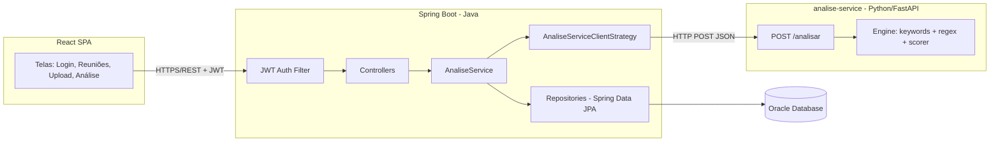
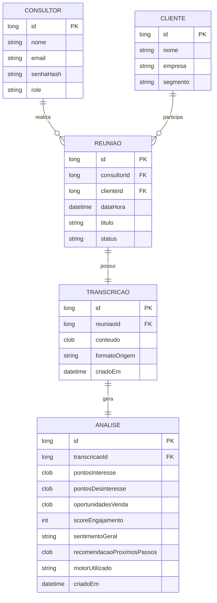

# Documento de Design de Software (SDD) — InsightCall

**Versão:** 1.0
**Autor:** Kelwin Silva Bastos
**Data:** 04/09/2026
**Contexto:** Challenge TOTVS 2026 — FIAP

---

## 1. Introdução

### 1.1 Objetivo
Este documento descreve a arquitetura, o modelo de dados e as decisões técnicas do **InsightCall**, uma plataforma web para armazenamento de transcrições de reuniões por consultor e análise automática do conteúdo, identificando pontos de interesse, desinteresse e oportunidades de venda.

### 1.2 Problema de negócio
Consultores realizam diversas reuniões com clientes e, hoje, a transcrição dessas conversas fica dispersa (arquivos soltos, e-mails, etc.), sem padronização e sem nenhuma extração de insight. Isso gera perda de informação comercial relevante e retrabalho para relembrar o que foi discutido.

### 1.3 Restrições do projeto
| Restrição | Impacto no design |
|---|---|
| Prazo até 15/10/2026, 2 desenvolvedores | Permite paralelizar backend Java e motor Python, desde que o contrato entre eles seja acordado cedo |
| Stack: Spring Boot, Spring Data, JWT, Oracle, React + Python/FastAPI | Dois runtimes distintos para subir e manter |
| Banco Oracle compartilhado da faculdade | Depende de rede/VPN da instituição; fora do controle da equipe |
| Apresentação para a TOTVS | Precisa de uma demo estável, com os **dois serviços** no ar simultaneamente |

---

## 2. Requisitos

### 2.1 Requisitos Funcionais (RF)

| ID | Descrição | Prioridade (MoSCoW) |
|---|---|---|
| RF01 | Consultor deve poder se cadastrar e fazer login (JWT) | Must |
| RF02 | Consultor deve poder cadastrar um cliente e uma reunião | Must |
| RF03 | Consultor deve poder enviar (upload/colar) a transcrição de uma reunião | Must |
| RF04 | Sistema deve processar a transcrição e gerar uma análise (interesse, desinteresse, oportunidades, score) | Must |
| RF05 | Consultor deve poder visualizar o resultado da análise de uma reunião | Must |
| RF06 | Consultor deve poder listar/filtrar suas próprias reuniões e transcrições | Should |
| RF07 | Sistema deve permitir reprocessar uma análise | Could |
| RF08 | Painel resumido com contagem de reuniões e oportunidades identificadas | Could |
| RF09 | Papel ADMIN capaz de ver reuniões de todos os consultores | Won't (nesta entrega) |

### 2.2 Requisitos Não Funcionais (RNF)

| ID | Descrição |
|---|---|
| RNF01 | Autenticação stateless via JWT, senha com hash BCrypt |
| RNF02 | A análise usa LLM como motor primário; dado o tamanho médio real das transcrições do dataset (~100 mil caracteres, podendo chegar a ~200 mil), a resposta pode levar até 2 minutos. O frontend deve exibir estado de carregamento durante a espera. O timeout entre Java e o serviço Python é configurável via `ANALISE_SERVICE_TIMEOUT_MS` |
| RNF03 | Conexão configurável via variáveis de ambiente com o servidor Oracle da faculdade (sem dependência de infraestrutura local de banco) |
| RNF04 | O motor de análise deve ser um serviço independente e **stateless**, permitindo evoluir a lógica de análise (troca de provedor de LLM, ajuste de prompt, modelo local) sem qualquer alteração no backend Java |
| RNF05 | Ambos os serviços documentados via OpenAPI/Swagger (springdoc no Java, nativo no FastAPI) |
| RNF06 | A indisponibilidade do motor primário de análise **não pode derrubar** o restante da aplicação, nem impedir uma resposta: cadeia de fallback de 3 níveis (LLM primária → LLM secundária → motor de regex). Login, CRUDs e upload de transcrição continuam funcionando independentemente do estado dos motores de análise |

---

## 3. Arquitetura

### 3.1 Visão geral

O sistema é composto por **dois serviços independentes** mais o frontend. O backend Java é o orquestrador e único dono do banco; o serviço Python é especializado em processamento de texto e não tem estado nem acesso a dados.



**Fluxo completo de uma análise:**
1. Consultor dispara `POST /api/transcricoes/{id}/analisar` no backend Java.
2. Java valida o JWT, confere se a transcrição pertence ao consultor e busca o `conteudo` no Oracle.
3. Java chama `POST /analisar` no serviço Python, enviando apenas o **texto** da transcrição.
4. Python processa e devolve os insights estruturados em JSON (sem persistir nada).
5. Java recebe o JSON, monta a entidade `Analise` e **persiste no Oracle**.
6. Java devolve o resultado para o frontend.

### 3.2 Justificativa arquitetural

A separação em dois serviços foi motivada por **adequação de ferramenta ao problema**: o processamento e a manipulação de texto se beneficiam do ecossistema Python (bibliotecas de NLP, manipulação de dados, facilidade de experimentação), enquanto a camada transacional (autenticação, CRUDs, integridade dos dados) permanece no Spring Boot, onde já está madura e testada.

Essa divisão também **viabiliza o trabalho em paralelo** entre os dois integrantes da equipe: com o contrato da API acordado previamente (seção 7), cada frente evolui de forma independente.

**Custo assumido conscientemente:** dois runtimes para subir e manter, um ponto de falha de rede a mais, e a necessidade de garantir que ambos os serviços estejam no ar durante a apresentação. O RNF06 mitiga parte disso, garantindo degradação graciosa em vez de falha total.

### 3.3 Camadas (backend Java)

- **Controller**: expõe os endpoints REST, valida entrada (Bean Validation) e traduz para DTOs.
- **Service**: contém a regra de negócio (ex: `TranscricaoService`, `AnaliseService`, `AuthService`).
- **Strategy de análise** (`domain.analise`): a interface `AnaliseStrategy` é mantida, mas a implementação passa a ser `AnaliseServiceClientStrategy` — um **cliente HTTP** que delega o processamento ao serviço Python, em vez de conter a lógica de análise.
- **Repository**: interfaces Spring Data JPA sobre as entidades.
- **Security**: filtro JWT, `UserDetailsService`, configuração de rotas públicas/privadas.

> 💡 **A decisão original de usar o padrão Strategy se provou acertada:** a troca do motor de análise (de uma implementação Java local para uma chamada HTTP a um serviço Python) exigiu apenas uma nova implementação da interface — nenhum Controller, Repository ou entidade precisou ser alterado. Esse é um bom argumento de design para a apresentação.

---

## 4. Modelo de dados

### 4.1 Entidades principais



### 4.2 Observações de modelagem
- `TRANSCRICAO.conteudo` e os campos de `ANALISE` usam **CLOB** por serem textos longos, compatível com Oracle.
- `STATUS` de `REUNIAO` como enum: `AGENDADA`, `REALIZADA`, `ANALISADA`.
- `pontosInteresse`, `pontosDesinteresse` e `oportunidadesVenda` são armazenados como JSON serializado dentro do CLOB — agora uma lista de objetos `{descricao, trecho}` (evidência ancorada na transcrição), não mais strings simples.
- `recomendacaoProximosPassos` (CLOB, nullable) é preenchido apenas quando o motor utilizado foi uma LLM; fica `null` quando a análise caiu no fallback de regex.
- `motorUtilizado` (string) registra qual camada da cadeia de fallback gerou aquele resultado (`LLM_PRIMARIA`, `LLM_SECUNDARIA`, `MODELO_LOCAL` ou `REGEX_FALLBACK`) — usado pelo frontend para sinalizar ao consultor quando uma análise foi simplificada.
- Reanálise sobrescreve o registro existente (mesma linha, sem histórico de tentativas anteriores) — mantém a relação 1:1 já modelada sem exigir migração de schema.

---

## 5. Design da API REST

| Método | Endpoint | Descrição | Autenticação |
|---|---|---|---|
| POST | `/api/auth/register` | Cadastro de consultor | Pública |
| POST | `/api/auth/login` | Login, retorna JWT | Pública |
| GET | `/api/clientes` | Lista clientes | JWT |
| POST | `/api/clientes` | Cria cliente | JWT |
| GET | `/api/reunioes` | Lista reuniões do consultor logado | JWT |
| POST | `/api/reunioes` | Cria reunião | JWT |
| POST | `/api/reunioes/{id}/transcricao` | Envia transcrição de uma reunião | JWT |
| POST | `/api/transcricoes/{id}/analisar` | Dispara a análise da transcrição | JWT |
| GET | `/api/transcricoes/{id}/analise` | Consulta resultado da análise | JWT |
| GET | `/api/dashboard/resumo` | Métricas resumidas do consultor | JWT |

---

## 6. Segurança

- Autenticação **stateless** via JWT (sem sessão em servidor).
- Fluxo: login → gera token assinado (HMAC) com `sub` (email), `role` e expiração → cliente envia `Authorization: Bearer <token>` em cada request → `JwtAuthFilter` valida assinatura/expiração e popula o `SecurityContext`.
- Senhas armazenadas com **BCrypt**.
- Endpoints `/api/auth/**` públicos; todo o restante exige token válido.
- CORS liberado apenas para a origem do frontend (`localhost:5173` em dev).

---

## 7. Motor de análise (detalhamento)

### 7.1 Interface

A interface `AnaliseEngine` (Python) e `AnaliseStrategy` (Java) permanecem como o ponto de extensão do sistema. Do lado Python, existem agora **quatro implementações em cadeia**:

```
AnaliseEngine (interface)
├── LlmEngine (parametrizável por provedor — usada duas vezes: primária e secundária)
├── ModeloLocalEngine (classificador treinado pelo grupo de Data Science, estendido por distillation)
└── RegexEngine (a implementação original, mantida como último recurso absoluto)
```

Um orquestrador (`AnaliseOrchestrator`) tenta cada engine em ordem, avançando para a próxima em caso de falha:

```
LLM primária (Claude ou ChatGPT — definido após teste comparativo)
    → falhou (timeout, erro do provedor, JSON malformado)
LLM secundária (o outro provedor)
    → falhou também
Modelo de classificação local (ModeloLocalEngine)
    → falhou também (ou indisponível/não carregado)
Motor de regex (último recurso, sempre disponível, sem dependência externa)
```

**Por que duas LLMs de provedores diferentes:** protege contra indisponibilidade ou limite de cota específicos de um provedor. **Não** protege contra falha de rede da própria aplicação (ex: sem internet) — mas esse risco foi avaliado como baixo, já que a apresentação ocorre nas instalações da TOTVS, não em rede da faculdade.

**Por que o modelo local entra como 3ª camada, não como principal:** ele é originado do notebook de Machine Learning supervisionado da equipe (disciplina de Data Science, ver seção 8), que resolve uma fração do contrato — hoje classifica risco/neutro por trecho. Estendido por distillation (rótulos gerados pela LLM principal, usados para treinar mais dois classificadores) mais uma etapa de agregação por reunião, ele passa a cobrir `pontosInteresse`, `pontosDesinteresse`, `oportunidadesVenda`, `scoreEngajamento` e `sentimentoGeral` — mas nunca `recomendacaoProximosPassos`, que exige um modelo generativo, não um classificador discriminativo. Além disso, foi treinado no corpus real e anonimizado da TOTVS (disciplina de Data Science), um domínio diferente dos dados sintéticos do produto — validar com uma amostra dos dados de seed antes de confiar nele em produção.

**Por que o regex nunca foi descartado:** ele é a única camada 100% local e sem qualquer dependência de modelo treinado ou API externa — a rede de segurança final para a demonstração nunca falhar por completo.

### 7.2 Contrato da API entre os serviços

Ponto de acordo entre as duas frentes de trabalho. Alterações exigem alinhamento entre os dois integrantes.

**Requisição** — `POST http://<analise-service>/analisar` (inalterada)

```json
{
  "conteudo": "[00:02] Consultor: Bom dia, Marina...",
  "formatoOrigem": "TXT"
}
```

**Resposta** — `200 OK`

```json
{
  "pontosInteresse": [
    {
      "descricao": "Demonstrou urgência para resolver o controle de obras neste trimestre.",
      "trecho": "[00:15] Cliente: queremos resolver isso ainda neste trimestre"
    }
  ],
  "pontosDesinteresse": [
    {
      "descricao": "Valor da licença acima do previsto para o primeiro ano.",
      "trecho": "[02:40] Cliente: o valor ficou um pouco acima do que a gente previu"
    }
  ],
  "oportunidadesVenda": [
    {
      "descricao": "Integração com o ERP já utilizado pela construtora.",
      "trecho": "[05:10] Cliente: faz sentido, principalmente se integrar com o ERP"
    }
  ],
  "scoreEngajamento": 81,
  "sentimentoGeral": "POSITIVO",
  "recomendacaoProximosPassos": "Leve uma simulação de cronograma que evite a alta temporada de obras — principal trava levantada. Traga o gerente de operações, conforme pedido pela cliente.",
  "motorUtilizado": "LLM_PRIMARIA"
}
```

**Campos novos em relação à v1 (regex apenas):**

| Campo | Tipo | Observação |
|---|---|---|
| `pontosInteresse` / `pontosDesinteresse` / `oportunidadesVenda` | lista de objetos `{descricao, trecho}` | antes eram listas de strings simples. O `trecho` é uma citação verbatim da transcrição, usada como evidência — reduz alucinação da LLM e permite ao consultor conferir a fonte. O motor de regex também popula `trecho` (ele naturalmente sabe a posição do match) |
| `sentimentoGeral` | enum `POSITIVO \| NEUTRO \| NEGATIVO` | antes era string livre; virou enum para evitar variação de grafia da LLM |
| `recomendacaoProximosPassos` | string, máx. ~500 caracteres, nullable | narrativa curta gerada só por uma LLM (generativa). **Nulo quando `motorUtilizado` é `MODELO_LOCAL` ou `REGEX_FALLBACK`** — nenhum dos dois é capaz de gerar texto narrativo (o classificador é discriminativo, não generativo). O frontend esconde essa seção quando o campo vem nulo |
| `motorUtilizado` | enum `LLM_PRIMARIA \| LLM_SECUNDARIA \| MODELO_LOCAL \| REGEX_FALLBACK` | indica qual camada da cadeia de fallback realmente gerou aquele resultado. Usado pelo frontend para exibir o aviso "análise simplificada — você pode gerar uma nova mais tarde" quando o valor é `MODELO_LOCAL` ou `REGEX_FALLBACK` |

**Erros previstos:**

| Status | Situação | Tratamento no lado Java |
|---|---|---|
| 422 | Texto vazio ou curto demais para analisar | Propaga como erro de validação para o consultor |
| 500 | Falha interna no motor (nas quatro camadas) | Log + mensagem genérica; a `Analise` não é persistida |
| Timeout / conexão recusada | Serviço Python inteiro fora do ar | Erro tratado conforme RNF06; demais funcionalidades seguem normais |

### 7.3 Implementação do motor (Python)

**Motor primário e secundário (LLM):**
- `LlmEngine` recebe o provedor como parâmetro de configuração (variável de ambiente), permitindo instanciar a mesma classe duas vezes com provedores diferentes;
- Uso do modo de saída estruturada do provedor (function calling / structured output) + validação **Pydantic** do JSON retornado — se o parsing falhar, é tratado como falha desta camada e a cadeia avança para a próxima;
- Prompt instrui o modelo a citar o `trecho` verbatim da transcrição para cada insight (mitigação de alucinação) e limita `recomendacaoProximosPassos` a ~500 caracteres (reforçado também via `max_length` no Pydantic);
- **Atenção ao efeito "lost in the middle":** modelos de linguagem perdem precisão para informação no meio de contextos muito longos, mesmo dentro do limite técnico da janela de contexto. Como o dataset tem transcrições na casa de 100-200 mil caracteres, isso é um risco real de qualidade a observar durante os testes — não apenas um problema de limite técnico;
- `ANALISE_SERVICE_TIMEOUT_MS` deve ser generoso (ver RNF02) por causa do volume de texto processado por chamada.

**Modelo de classificação local (3ª camada) — origem no notebook de Data Science da equipe:**
- Ponto de partida: classificador risco/neutro por trecho (TF-IDF + Logistic Regression, com validação agrupada por cliente), já treinado e avaliado pela disciplina de Data Science sobre o corpus real anonimizado da TOTVS;
- **Extensão por distillation:** a LLM principal rotula um lote de trechos como interesse/não-interesse e oportunidade/não-oportunidade; esses rótulos treinam dois classificadores adicionais, no mesmo padrão do classificador de risco já existente;
- **Agregação por reunião:** como os classificadores operam por trecho, uma etapa nova consolida os trechos classificados de uma transcrição em `scoreEngajamento` (proporção de trechos positivos, normalizada) e `sentimentoGeral` (predominância entre as três categorias);
- `pontosInteresse` / `pontosDesinteresse` / `oportunidadesVenda` são preenchidos com os trechos classificados positivamente em cada categoria (o próprio trecho serve de evidência, sem necessidade de gerar `descricao` nova — pode usar o trecho como está ou uma versão levemente resumida);
- `recomendacaoProximosPassos` sempre `null` nesta camada — classificadores discriminativos não geram texto novo;
- **Risco de domínio, documentado na seção 9:** o modelo foi treinado no corpus real da TOTVS (Customer Success), diferente do domínio sintético dos dados de seed do produto. Validar com uma amostra dos dados reais do app antes de confiar nele em produção;
- Modelo e vetorizador (`TfidfVectorizer` + classificadores) serializados via `joblib` e carregados uma vez na subida do serviço, não a cada requisição.

**Motor de último recurso (regex) — mantido da v1:**
- Listas de palavras-chave (PT-BR) por categoria em `engine/keywords.py`;
- Regex (`engine/extractor.py`) para valores, prazos e entidades — e agora também para o `trecho` de evidência de cada insight;
- Score de engajamento (`engine/scorer.py`);
- `recomendacaoProximosPassos` sempre `null` nesta camada.

**Orquestração:**
- `AnaliseOrchestrator` tenta LLM primária → LLM secundária → modelo local → regex, nessa ordem, avançando a cada falha;
- Preenche `motorUtilizado` com a camada que efetivamente respondeu.

### 7.4 Implementação do cliente (Java)

- `AnaliseServiceClientStrategy` implementa `AnaliseStrategy`, inalterada em sua função — chama o serviço Python e converte a resposta para `ResultadoAnalise`;
- `ResultadoAnalise` (DTO) ganha os campos `recomendacaoProximosPassos`, `motorUtilizado` (agora com 4 valores possíveis), e os itens de insight passam a ser um record aninhado (`ItemAnalise(descricao, trecho)`) em vez de `String`;
- **Suporte a reanálise:** ao disparar a análise para uma transcrição que já possui um resultado (por exemplo, a primeira tentativa caiu no fallback de regex ou do modelo local), o `AnaliseService` faz um *upsert* — busca a `Analise` existente e atualiza seus campos, em vez de tentar inserir um novo registro. Isso preserva a relação 1:1 já modelada (`UNIQUE` em `TRANSCRICAO_ID`) sem exigir migração de schema; o histórico de tentativas anteriores não é mantido, apenas o resultado mais recente;
- Timeout do `RestClient` elevado para acomodar o RNF02 revisado.

### 7.5 Extensibilidade futura

- Trocar o provedor de LLM (ou adicionar um terceiro na cadeia) exige apenas configuração, sem alteração de código;
- Um modelo local (ex: via Ollama) pode substituir uma ou ambas as LLMs em nuvem, caso a confidencialidade dos dados do cliente se torne um requisito de produção — ver discussão de LGPD na seção 9;
- **Fine-tuning de um modelo generativo local (LoRA/QLoRA) para substituir o classificador discriminativo da 3ª camada** — geraria também `recomendacaoProximosPassos` no fallback, algo que nenhum classificador consegue fazer. Tratado como **experimento paralelo de aprendizado**, fora do caminho crítico da Fase 2: só entra na arquitetura de fato se um protótipo pequeno (100-200 exemplos, gerados por distillation da LLM principal, modelo base pequeno tipo Llama 3.x 1B-3B) mostrar resultado bom a tempo. Caso contrário, permanece documentado aqui como próximo passo, sem prejuízo à entrega da Fase 2 com a versão de 4 camadas já especificada;
- **Processamento em partes (map-reduce) para transcrições muito grandes** (o dataset chega a ~200 mil caracteres): dividir o texto em partes, extrair insights de cada uma em paralelo (mantendo o `trecho` de evidência em cada parte — nunca resumir antes de extrair, sob risco de perder a citação verbatim) e fazer uma chamada final de consolidação. Esse pipeline inteiro continua sendo uma única tentativa da LLM primária; a LLM secundária permanece como fallback independente, nunca como etapa obrigatória do processamento. Só vale implementar se a medição de latência de uma chamada única mostrar necessidade real — ver stretch goal na Fase 5 do planejamento.

## 8. Decisões técnicas e trade-offs

| Decisão | Alternativa considerada | Motivo da escolha |
|---|---|---|
| **Motor de análise em Python (FastAPI), como serviço separado** | Motor em Java, dentro do monolito | Manipulação e processamento de texto se beneficiam do ecossistema Python; permite paralelizar o trabalho entre os dois integrantes. Custo: dois runtimes, integração HTTP e um ponto de falha a mais |
| **FastAPI** | Flask | Documentação OpenAPI automática e validação via Pydantic saem de graça, reforçando o contrato entre os serviços. Flask seria viável (a equipe já tem experiência), mas exigiria montar validação e docs manualmente |
| **Java persiste a `Analise`; Python é stateless** | Python gravar direto no Oracle | Mantém um único dono do banco, evitando duas fontes de escrita, duas configurações de credencial e risco de inconsistência. O serviço Python fica mais simples e trivialmente testável |
| **Comunicação síncrona via HTTP/REST** | Fila de mensagens (RabbitMQ/Kafka) | Volume da demo é baixo e o usuário espera o resultado na tela; fila adicionaria complexidade sem ganho perceptível neste escopo |
| **Motor de análise via LLM (API em nuvem), com cadeia de fallback de 3 níveis** | Regex apenas (v1); modelo local (Ollama) | Qualidade de análise muito superior ao regex para linguagem natural variável. Modelo local ficou documentado como opção futura de privacidade (seção 7.5), não descartado, apenas adiado — exige mais tempo de setup e hardware que o prazo não permite agora |
| **Duas LLMs de provedores diferentes em cadeia, regex como último recurso** | Uma única LLM sem fallback | Protege contra indisponibilidade/cota específica de um provedor. Regex nunca foi removido: é a única camada sem dependência externa, garantindo que a demo nunca fique sem nenhuma resposta |
| **Insights ancorados em evidência** (`descricao` + `trecho` verbatim da transcrição) | Listas de strings simples (v1) | Reduz alucinação da LLM (o modelo precisa apontar onde viu aquilo) e permite ao consultor conferir a fonte. Benefício colateral: também melhora o motor de regex, que já sabe a posição do match |
| **`recomendacaoProximosPassos` só na LLM, nulo no fallback de regex** | Gerar um texto template genérico no regex | Regex não tem capacidade de gerar linguagem natural coerente; um texto template soaria artificial. Optou-se por simplesmente omitir a seção no frontend quando ausente, com aviso de que a análise foi simplificada |
| **Reanálise via sobrescrita (upsert) do registro existente** | Manter histórico de todas as tentativas de análise | Mais simples de implementar sob o prazo — não exige alterar a relação 1:1 já modelada entre `Transcricao` e `Analise`. Custo: perde-se o histórico de tentativas anteriores |
| **Adotado: classificador supervisionado (origem: disciplina de Data Science) como 3ª camada, estendido por distillation** | Treinar do zero com o dataset de 10 mil transcrições sintéticas | O grupo já possui um classificador de risco/neutro por trecho, treinado e validado (agrupamento por cliente, blindagem de vocabulário) sobre o corpus real da TOTVS numa disciplina paralela. Estendê-lo via distillation (rótulos gerados pela LLM principal para as categorias que faltam) é viável no prazo; treinar do zero com o dataset de 10 mil sintético permanece descartado pelo motivo abaixo |
| **Descartado: treinar do zero com o dataset de 10 mil transcrições sintéticas** | — | Esse dataset específico não possui rótulo/avaliação (não há gabarito de "boa reunião" ou "isso é uma objeção"). Rotular manualmente um volume relevante é um esforço de meses, incompatível com o prazo |
| **Rejeitado: modelo de ML genérico pré-treinado como camada intermediária de fallback** | Usar um classificador de sentimento de prateleira (ex: Hugging Face) antes do regex | Modelos genéricos pré-treinados classificam sentimento geral bem, mas não distinguem interesse/objeção/oportunidade — categorização específica do domínio de vendas B2B. Para este contrato de saída, entregaria menos estrutura que o próprio motor de regex, tornando-se um fallback pior, não melhor. Superado pela adoção do classificador próprio da disciplina de Data Science, que já resolve essa distinção |
| Servidor Oracle da faculdade (compartilhado) | Oracle XE local via Docker | Infraestrutura já provisionada pela instituição; evita manter container local, mas introduz dependência de rede/VPN e de disponibilidade fora do controle da equipe |
| JSON dentro de CLOB para listas de insights | Tabelas normalizadas (ex: `PONTO_INTERESSE`) | Reduz número de entidades/joins; o formato já chega pronto do serviço Python |

---

## 9. Riscos e mitigação

| Risco | Probabilidade | Mitigação |
|---|---|---|
| Acesso ao servidor Oracle da faculdade indisponível ou dependente de VPN/rede específica | Média-Alta | Validar credenciais e conectividade **antes** do Sprint 0 (não esperar o fim de semana); confirmar com a TI da faculdade horário de disponibilidade do servidor |
| Servidor Oracle da faculdade instável ou lento (compartilhado com outros alunos/projetos) | Média | Ter um script de criação das tabelas pronto para recriar o schema rapidamente se necessário; evitar depender de uma janela específica de horário para testar |
| JWT mal configurado gerar bugs de autenticação | Baixa | Reaproveitar implementação já validada em projetos anteriores |
| **Divergência entre o que o Java envia e o que o Python espera** (contrato quebrado) | **Alta** | Fechar o contrato da seção 7.2 **antes** de cada frente começar a codar; validar com Pydantic no Python e testes de integração no Java |
| **Serviço Python fora do ar durante a apresentação** | Média | Checklist de subida dos dois serviços antes da demo; RNF06 garante que o resto da aplicação continue funcionando; ter prints/vídeo do fluxo de análise como plano B |
| **Trabalho paralelo gerar retrabalho ou bloqueio mútuo** | Média | Divisão clara de responsabilidades (seção 8 do README); contrato acordado permite cada um trabalhar com um mock do outro lado |
| **Alucinação da LLM** (insight inventado que o cliente nunca disse) | Média | Insights ancorados em evidência verbatim (`trecho`) — reduz a chance e permite ao consultor conferir a fonte antes de confiar na análise |
| **As duas LLMs falharem ao mesmo tempo** (quota, mudança de API, não apenas rede) | Baixa-Média | Duas camadas de segurança abaixo: modelo local, depois regex — a análise nunca retorna erro puro; `motorUtilizado` avisa o consultor quando a análise foi simplificada |
| **Modelo local (3ª camada) generalizar mal para o domínio do produto** — foi treinado no corpus real da TOTVS, os dados de seed do app são sintéticos | Média | Validar com uma amostra dos dados de seed antes de confiar no modelo em produção; como ele só atua depois de duas LLMs falharem, um resultado abaixo do ideal aqui ainda é preferível a nenhum resultado |
| **Latência alta com transcrições grandes** (dataset tem médias de ~100 mil caracteres, podendo chegar a ~200 mil) prejudicar a demo | Média | RNF02 revisado para até 2 minutos com loading no frontend; timeout do `RestClient` generoso; testar com uma transcrição real de tamanho grande antes da apresentação, não só com dados de seed curtos |
| **LGPD/confidencialidade** de mandar transcrições de clientes para API de LLM de terceiros | Baixa (dataset de teste é sintético) | Não é um risco imediato porque o dataset usado é mockado, não dados reais de cliente. Documentado como ponto de atenção para uma eventual produção real — resposta preparada: a arquitetura permite trocar por modelo local (Ollama) sem alteração no Java |
| Escopo aumentar durante o desenvolvimento | Alta | Lista de RF com MoSCoW travada; qualquer item novo vira "Won't" nesta entrega |
| Falta de tempo para o frontend | Média | Frontend com no máximo 4 telas (login, reuniões, upload, resultado da análise) |

---

## 10. Plano de testes (mínimo viável)

**Backend Java (JUnit + Mockito):**
- `AuthService` (login/registro, geração de token);
- Checagem de *ownership* (`Reuniao.pertenceA`) — garantir que um consultor não acessa dados de outro;
- `AnaliseServiceClientStrategy` com o serviço Python **mockado**, cobrindo resposta de sucesso, 5xx e timeout.

**Serviço Python (pytest):**
- `RegexEngine`: dado um texto de exemplo, verifica se os insights (com `trecho` de evidência) e o score saem corretos;
- `LlmEngine`: teste com a chamada ao provedor mockada, cobrindo JSON válido, JSON malformado (deve falhar e repassar a falha ao orquestrador) e timeout;
- `AnaliseOrchestrator`: cobrir os cenários de fallback (LLM primária responde; primária falha e secundária responde; as duas LLMs falham e o modelo local responde; as três falham e cai no regex), verificando se `motorUtilizado` reflete corretamente cada caso;
- `ModeloLocalEngine`: validar com uma amostra dos dados de seed do produto (domínio sintético), não só com o corpus real da TOTVS usado no treino original;
- Endpoint `/analisar`: resposta 200 no caminho feliz e 422 para texto vazio/curto demais.

**Integração e manual:**
- Teste de ponta a ponta com os **dois serviços no ar**: upload de transcrição → disparo da análise → resultado persistido no Oracle;
- **Teste com transcrição de tamanho real** (~100-200 mil caracteres, não só os dados de seed curtos) para validar o RNF02 revisado e o timeout configurado;
- Teste de reanálise: disparar a análise duas vezes para a mesma transcrição e confirmar que o segundo resultado sobrescreve o primeiro (upsert), sem violar a constraint `UNIQUE` em `TRANSCRICAO_ID`;
- Testes manuais via Swagger (Java, porta 8080) e `/docs` (Python, porta 8000);
- Roteiro de demonstração com dados de *seed* (2–3 transcrições de exemplo já cadastradas) para garantir uma apresentação estável em 15/10.