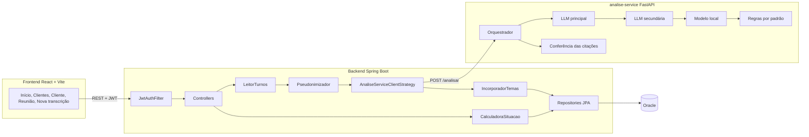
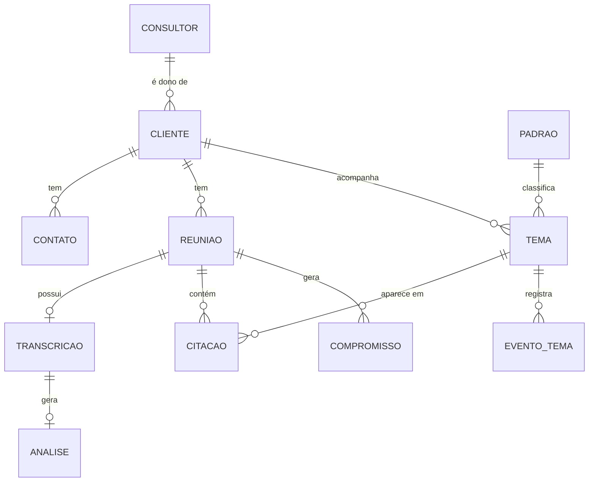

# Documento de Design de Software (SDD) — InsightCall

**Versão:** 3.0
**Autores:** Kelwin Silva Bastos e equipe
**Data:** 09/10/2026
**Contexto:** Challenge TOTVS 2026 — FIAP
**Datas que importam:** banca TOTVS em **14/10/2026** e entrega final para a FIAP em **21/10/2026**

| Versão | Data | O que mudou |
|---|---|---|
| 1.0 | 04/09/2026 | Primeira versão: análise por reunião, motor de regras |
| 2.0 | 28/09/2026 | Motor no analise-service (Python), cadeia de quatro motores, evidência por trecho, prazo de 14/10 |
| 3.0 | 09/10/2026 | A unidade do produto passa a ser o **cliente com temas acompanhados**; perfis vendedor e gestor; contrato v3 com o analise-service; pseudonimização; conferência das citações; fases banca e entrega |

**Documentos irmãos:**
- `docs/HANDOFF_INTERFACE.md`: descrição completa da interface (demo `InsightCallApp.jsx`), das regras de negócio e dos 32 casos de teste da situação dos temas. Onde este SDD diz "ver handoff, seção X", o detalhe está lá.
- `docs/DIVISAO_TRABALHO.md`: quem faz o quê e em que ordem até a banca e até a entrega.

**Como ler as marcações:** **[banca]** entra até 14/10; **[entrega]** entra até 21/10; **[roadmap]** fica documentado para depois; **[aberto]** ainda não foi decidido.

---

## 1. Introdução

### 1.1 Objetivo
O **InsightCall** é uma plataforma de IA para vendas B2B. O vendedor envia a transcrição de cada reunião com um cliente; o sistema identifica os **temas** da conversa (riscos e oportunidades, de uma lista fechada de padrões), aponta a **citação literal** que sustenta cada tema e acompanha esses temas de uma reunião para a outra. O resultado responde a duas perguntas:

- **Vendedor:** o que pede minha atenção hoje, em cada cliente?
- **Gestor:** quais assuntos se repetem entre os clientes do time, e onde cada vendedor precisa de apoio?

### 1.2 Problema de negócio
Vendedores e consultores fazem muitas reuniões, e o que o cliente disse fica disperso em arquivos soltos, sem padronização e sem acompanhamento. Uma objeção de preço citada numa reunião e não respondida volta três semanas depois, e ninguém percebe; uma oportunidade de expansão passa da hora sem tratamento. O InsightCall transforma cada conversa em temas acompanhados, com evidência, e mostra o que ficou sem retorno.

### 1.3 O que mudou da v2.0 para a v3.0

| v2.0 (28/09) | v3.0 (09/10) |
|---|---|
| A unidade é a reunião isolada, com a análise dela | A unidade é o **cliente** (a empresa), com **temas acompanhados** entre reuniões |
| Análise com listas de interesse, desinteresse e oportunidades em JSON | **Temas** com padrão de uma lista fechada de 14, citação conferida, turno e leitura de "respondido na conversa" |
| Um perfil (consultor) | **Vendedor** e **gestor**; o gestor só lê |
| Nada depois da análise | Ações do vendedor no tema: **Tratei fora da reunião** e **Não procede** (e, na entrega, **Avisar gestor**) |
| Texto enviado em claro à LLM | **Pseudonimização** antes de qualquer LLM externa (LGPD) |
| Transcrição com horário (`[00:02] Consultor:`) | Formato do dataset: `[LOCUTOR n]` por linha, **sem horário**, numerado em turnos por uma regra única |

### 1.4 Restrições do projeto

| Restrição | Impacto no design |
|---|---|
| Banca em 14/10 e entrega em 21/10, com 2 desenvolvedores | O escopo é dividido em fases; tudo marcado [banca] é o mínimo para o roteiro da demonstração rodar no backend real |
| Stack: Spring Boot 4.1 (Java 25), Spring Data JPA, JWT, Oracle, React + Vite, Python/FastAPI | Três projetos para subir e manter |
| Banco Oracle compartilhado da faculdade, com `ddl-auto=update` | Colunas novas precisam ser anuláveis; colunas e restrições antigas não são removidas sozinhas |
| Chaves de API das LLMs ainda não definidas | Sem LLM, o produto funciona em contingência, com muito menos conteúdo. A carga inicial de dados (seção 9.4) garante a banca nesse cenário |
| Dados do corpus da TOTVS | Só para teste interno; a demonstração usa apenas dados fictícios |

---

## 2. Requisitos

### 2.1 Requisitos funcionais

| ID | Descrição | Fase |
|---|---|---|
| RF01 | Cadastro e login com JWT; o token carrega o perfil (vendedor ou gestor) | [banca] |
| RF02 | Cadastro de cliente (a empresa) com tipo, segmento, vendedor dono e contatos | [banca] |
| RF03 | Cadastro de reunião (agendada, realizada sem transcrição ou analisada) | [banca] |
| RF04 | Envio da transcrição (colar ou arquivo `.txt`), com limite de tamanho e bloqueio de duplicata | [banca] |
| RF05 | Análise da transcrição pela cadeia de motores, com pseudonimização e conferência das citações | [banca] |
| RF06 | Incorporação da análise nos temas do cliente (tema novo ou nova citação de tema existente) | [banca] |
| RF07 | Situação de cada tema calculada pela janela de acompanhamento (seção 5.4) | [banca] |
| RF08 | Página do cliente: mapa de temas, reuniões e painel do tema com as citações | [banca] |
| RF09 | Página da reunião: temas citados, pontos de interesse, resumo, engajamento e transcrição | [banca] |
| RF10 | Início do vendedor: riscos sem retorno e oportunidades sem tratamento no mesmo peso, mudanças e agenda | [banca] |
| RF11 | Ações do vendedor no tema: "Tratei fora da reunião" e "Não procede", ambas com desfazer | [banca] |
| RF12 | Compromissos do vendedor lidos na reunião, com prazo calculado e marcação de cumprido | [entrega] |
| RF13 | Telas do gestor: clientes com facetas, padrões entre clientes, vendedores e visão do vendedor (só leitura) | [entrega] |
| RF14 | "Avisar gestor": notificação simples que leva o gestor ao tema | [entrega] |
| RF15 | Janela de acompanhamento configurável pelo gestor, com prévia do impacto | [entrega] |
| RF16 | Cadastro pelo domínio do e-mail corporativo e convites | [entrega] |
| RF17 | Análise assíncrona com etapas, cancelamento e reprocessamento quando uma LLM voltar | [roadmap] |
| RF18 | Aviso de semelhança com temas marcados como "não procede" | [roadmap] |

### 2.2 Requisitos não funcionais

| ID | Descrição |
|---|---|
| RNF01 | Autenticação stateless via JWT; senha com BCrypt; perfil no token |
| RNF02 | A análise é **síncrona** na banca, com tempo limite de 120 s entre Java e Python (`ANALISE_SERVICE_TIMEOUT_MS`). A tela mostra o andamento enquanto espera |
| RNF03 | Conexão com o Oracle da faculdade por variáveis de ambiente |
| RNF04 | O analise-service é **stateless**: não acessa o banco nem guarda nada entre chamadas |
| RNF05 | Os dois serviços documentados por OpenAPI (springdoc no Java, nativo no FastAPI) |
| RNF06 | A queda do analise-service ou das LLMs **não derruba** o resto: login, cadastros, envio de transcrição e leitura continuam funcionando. Validado em 06/10 (503 com o Python fora do ar) |
| RNF07 | **LGPD:** nenhum nome real (pessoa, empresa, lugar) vai para uma LLM externa. O texto original e o mapa de pseudônimos ficam só no banco do InsightCall |
| RNF08 | **Evidência sempre:** todo trecho citado é recortado do texto e conferido. A LLM nunca escreve a citação; trecho não localizado é descartado e registrado |
| RNF09 | **Uma regra única de turnos:** só o Java numera os turnos; o Python recebe os turnos já numerados |
| RNF10 | Contagem de dias por **data civil** no fuso `America/Sao_Paulo` (`LocalDate` e `ChronoUnit.DAYS.between`) |
| RNF11 | Permissão checada no servidor em todo endpoint: perfil errado devolve 403; recurso de outro vendedor devolve 404 |
| RNF12 | Contingência visível: cada análise grava o motor que respondeu, e a interface mostra quando a análise foi simplificada |

---

## 3. Arquitetura

### 3.1 Visão geral

Três partes: o frontend React, o backend Java (orquestrador e **único dono do banco**) e o analise-service em Python (processamento de texto, sem estado).


```mermaid
flowchart LR
    subgraph FE[Frontend React + Vite]
        UI[Início, Clientes, Cliente, Reunião, Nova transcrição]
    end

    subgraph BE[Backend Spring Boot]
        SEC[JwtAuthFilter]
        CTRL[Controllers]
        TURN[LeitorTurnos]
        PSEUDO[Pseudonimizador]
        CLIENT[AnaliseServiceClientStrategy]
        INC[IncorporadorTemas]
        SIT[CalculadoraSituacao]
        REPO[Repositories JPA]
    end

    subgraph PY[analise-service FastAPI]
        ORQ[Orquestrador]
        LLM1[LLM principal]
        LLM2[LLM secundária]
        LOCAL[Modelo local]
        REGRAS[Regras por padrão]
        CONF[Conferência das citações]
    end

    DB[(Oracle)]

    UI -->|REST + JWT| SEC --> CTRL
    CTRL --> TURN --> PSEUDO --> CLIENT
    CLIENT -->|POST /analisar| ORQ
    ORQ --> LLM1 --> LLM2 --> LOCAL --> REGRAS
    ORQ --> CONF
    CLIENT --> INC --> REPO --> DB
    CTRL --> SIT
    SIT --> REPO
```

### 3.2 Fluxo de uma análise

1. O vendedor envia a transcrição (`POST /api/reunioes/{id}/transcricao`). O Java normaliza o texto, numera os turnos (seção 5.2), calcula o hash e recusa duplicata.
2. O vendedor dispara a análise (`POST /api/transcricoes/{id}/analisar`).
3. O Java **pseudonimiza** os turnos com os nomes do cadastro (cliente, contatos, vendedor) e guarda o mapa de pseudônimos (seção 5.6).
4. O Java chama `POST /analisar` no Python com os turnos pseudonimizados, a data da reunião, a lista de padrões e os contraexemplos ("não procede" anteriores).
5. O Python percorre a cadeia de motores, **confere cada citação** no turno indicado (seção 5.7) e devolve o resultado com o motor que respondeu e os sinais descartados.
6. O Java traduz as citações de volta para os nomes originais, grava a análise e **incorpora** os temas no cliente (seção 5.5).
7. O Java devolve o resumo (temas novos, temas atualizados, motor). A interface abre a página da reunião.

Se o Python estiver fora do ar ou passar do tempo limite, a transcrição continua gravada, a reunião fica "aguardando análise" e a resposta é **503** com mensagem (RNF06).

### 3.3 Por que cada coisa fica onde fica

| Responsabilidade | Onde | Motivo |
|---|---|---|
| Numerar os turnos | Java | Uma regra só (RNF09); o Java já é dono da transcrição |
| Pseudonimizar | Java | O dado pessoal não sai do serviço dono do banco; o Python nunca vê nome real, nem em log |
| Conferir as citações | Python | Acontece antes de responder, perto da LLM, e usa o texto exatamente como a LLM recebeu |
| Traduzir de volta e gravar | Java | Só o Java tem o mapa de pseudônimos e o banco |
| Calcular a situação dos temas | Java, na leitura | A situação muda com a data de hoje; calcular na leitura dispensa um job diário (seção 5.4) |

### 3.4 Pacotes do backend Java (package-by-feature)

```
com.challengetotvs.api
├── config/            RestClientConfig, SecurityConfig, CORS
├── security/          JwtAuthFilter, JwtProvider, ConsultorUserDetails, ConsultorDetailsService
├── exception/         GlobalExceptionHandler, AnaliseIndisponivelException, ErroResponse
└── domain/
    ├── consultor/     Consultor (o usuário, com perfil), AuthService, AuthController, MeController
    ├── cliente/       Cliente, Contato, ClienteService, ClienteController
    ├── reuniao/       Reuniao, StatusReuniao, ReuniaoService, ReuniaoController
    ├── transcricao/   Transcricao, LeitorTurnos, Turno, TranscricaoService, TranscricaoController
    ├── analise/       Analise, AnaliseService, AnaliseStrategy, AnaliseServiceClientStrategy,
    │                  Pseudonimizador, DTOs do contrato v3
    ├── tema/          Padrao, Tema, Citacao, EventoTema, CalculadoraSituacao,
    │                  IncorporadorTemas, TemaService, TemaController
    ├── inicio/        InicioService, InicioController (agregados do vendedor)
    └── motor/         MotorStatusController (repassa o /health do Python)
```

O padrão Strategy continua sendo o ponto de extensão do motor: o `AnaliseService` depende só da interface `AnaliseStrategy`.

---

## 4. Modelo de dados

### 4.1 Entidades


```mermaid
erDiagram
    CONSULTOR ||--o{ CLIENTE : "é dono de"
    CLIENTE ||--o{ CONTATO : "tem"
    CLIENTE ||--o{ REUNIAO : "tem"
    REUNIAO ||--o| TRANSCRICAO : "possui"
    TRANSCRICAO ||--o| ANALISE : "gera"
    CLIENTE ||--o{ TEMA : "acompanha"
    PADRAO ||--o{ TEMA : "classifica"
    TEMA ||--o{ CITACAO : "aparece em"
    REUNIAO ||--o{ CITACAO : "contém"
    TEMA ||--o{ EVENTO_TEMA : "registra"
    REUNIAO ||--o{ COMPROMISSO : "gera"
```

| Entidade | Campos | Fase | Observações |
|---|---|---|---|
| `CONSULTOR` | id, nome, email (único, minúsculo), senhaHash, **perfil** (`VENDEDOR`, `GESTOR`), **timeNome**, criadoEm | [banca] | É o "usuário" do handoff. O nome da classe fica `Consultor` para não renomear o que já funciona |
| `CLIENTE` | id, **nome (a empresa)**, **tipo** (`ATIVO`, `PROSPECT` ou nulo), segmento, **vendedorId** (dono), criadoEm | [banca] | Na v2.0 havia `nome` e `empresa`; agora `nome` é a empresa e a pessoa vai para `CONTATO` |
| `CONTATO` | id, clienteId, nome, cargo | [banca] | Nova |
| `REUNIAO` | id, clienteId, consultorId, contatoId, titulo, dataHora, **duracaoMin**, **status** (`AGENDADA`, `REALIZADA`, `ANALISADA`), **confirmada** | [banca] | `REALIZADA` aparece na tela como "aguardando transcrição" |
| `TRANSCRICAO` | id, reuniaoId, conteudo (CLOB), formatoOrigem (`COLADO`, `ARQUIVO`), **hashTexto**, **caracteres**, **turnos**, **locutores**, criadoEm | [banca] | Os turnos são lidos do CLOB na hora com a regra 5.2 |
| `ANALISE` | id, transcricaoId (único), motor, score, sentimento, resumo, papeis (JSON), interesse (JSON), proximosPassos (JSON), sentimentoSerie (JSON), descartados (JSON), **entidades (JSON)**, tentativas (JSON), duracaoMs, criadoEm | [banca] | Continua 1:1 com a transcrição; a reanálise atualiza o registro (upsert, como na v2.0). `entidades` é o mapa de pseudônimos: dado pessoal |
| `PADRAO` | chave (PK), nome, tipo (`RISCO`, `OPORTUNIDADE`), ativo | [banca] | Carga inicial com os 14 padrões do apêndice A |
| `TEMA` | id, clienteId, padraoChave, titulo, **risco** (bool), **oportunidade** (bool), anteriorId, criadoEm | [banca] | Os dois booleanos representam o tema duplo |
| `CITACAO` | id, temaId, reuniaoId, turno, **tratado** (`Boolean`, pode ser nulo), texto (original, conferido), criadoEm | [banca] | Uma citação por tema por reunião |
| `EVENTO_TEMA` | id, temaId, tipo (`TRATADO_FORA`, `NAO_PROCEDE`), acao, canal, dataAcao, observacao, motivo, porId, criadoEm, desfeitoEm | [banca] | Desfazer não apaga: preenche `desfeitoEm`. O vigente de cada tipo é o último sem `desfeitoEm` |
| `COMPROMISSO` | id, clienteId, reuniaoId, turno, texto, regraPrazo, prazo, cumprido, cumpridoEm | [entrega] | O contrato v3 já devolve os compromissos desde a banca |
| `NOTIFICACAO` | id, deId, paraId, clienteId, temaId, mensagem, criadoEm, lidaEm | [entrega] | "Avisar gestor" |
| `CONFIG_JANELA` | escopo, dias, alteradoPorId, alteradoEm | [entrega] | Na banca, a janela é fixa em 30 dias (`insightcall.janela-dias=30`) |
| `ORGANIZACAO`, `DOMINIO`, `CONVITE` | ver handoff, seção 9 | [entrega] | Cadastro por domínio e convites |

**Derivado, nunca gravado:** situação do tema, recorrência, reuniões na janela, `venceEm`, `perdidaEm`, indicadores dos clientes, números do Início e dos vendedores, agregados dos padrões.

### 4.2 Observações de modelagem e migração

- **`ddl-auto=update` só acrescenta.** As colunas antigas da `ANALISE` (`PONTOS_INTERESSE`, `PONTOS_DESINTERESSE`, `OPORTUNIDADES_VENDA`, `RECOMENDACAO_PROXIMOS_PASSOS`, `SENTIMENTO_GERAL`, `SCORE_ENGAJAMENTO`, `MOTOR_UTILIZADO`) continuam no banco. Ou elas são mapeadas como anuláveis e ignoradas, ou são removidas por script. Para a banca, o caminho mais seguro é **recriar o schema** com a carga inicial (seção 9.4).
- O mesmo vale para `CLIENTE.EMPRESA`: deixa de ser usada; o nome da empresa vai para `NOME`.
- Colunas novas em tabelas com dados precisam ser anuláveis, ou o `update` falha.
- Booleano anulável (`CITACAO.TRATADO`) no Oracle vira `NUMBER(1)` aceitando nulo: no Java, `Boolean` (objeto), nunca `boolean`.
- Enums com `@Enumerated(EnumType.STRING)`. No JSON, os valores seguem os da demo (`sem_retorno`, `llm1`, `ativo`) via `@JsonValue`, para a interface portar sem tradução.
- Listas da análise continuam como JSON em CLOB, escritas e lidas com o `ObjectMapper` do Jackson 3 (`tools.jackson.databind`).
- **Índices:** `TEMA(clienteId, padraoChave)`, `CITACAO(temaId)`, `CITACAO(reuniaoId)`, `REUNIAO(clienteId, dataHora)`, `CLIENTE(vendedorId)`, `TRANSCRICAO(hashTexto)`.

---

## 5. Regras de negócio

As regras abaixo rodam hoje no navegador, na demo (bloco "Regras" do `InsightCallApp.jsx`). Na v3.0, elas passam para o backend, que entrega tudo pronto nos DTOs; a interface só exibe. O detalhe completo está no handoff, seção 8.

### 5.1 Glossário mínimo

| Termo | Significado |
|---|---|
| Cliente | A empresa. Tem vendedor dono, tipo, segmento e contatos |
| Contato | A pessoa do lado do cliente |
| Turno | Cada fala marcada com `[LOCUTOR n]`, numerada a partir de 1 |
| Padrão | Um item da lista fechada de 14 assuntos (apêndice A) |
| Tema | Um padrão acompanhado dentro de um cliente, com as citações de cada reunião |
| Citação | O trecho literal que sustenta o tema numa reunião, com turno e `tratado` (`true`: respondido na reunião; `false`: sem resposta; `null`: o motor não sabe quem falou) |
| Situação | Estado do tema, calculado pelas citações, pela janela e pela data de hoje |
| Janela (W) | Dias que definem recorrência, oportunidade perdida e saída de pauta. 30 dias na banca |

### 5.2 Leitura dos turnos (regra única, no Java)

```text
1. Trocar \r\n e \r por \n.
2. Linha que casa com ^\s*\[LOCUTOR\s*(\d+)\]\s*:?\s*(.*)$ (sem diferenciar maiúsculas)
   abre um turno: locutor = o número; texto = o resto da linha, sem espaços nas pontas.
3. Linha não vazia sem a marcação é anexada ao texto do turno anterior, com um espaço.
   Linhas antes da primeira marcação são descartadas.
4. Turnos com texto vazio são removidos.
5. Os turnos que sobram são numerados 1, 2, 3...
```

- Transcrição sem nenhuma marcação `[LOCUTOR n]` gera zero turnos. **Decisão para a banca:** recusar com 422 `sem_locutor` e mensagem clara. Aceitar o rótulo "A:" fica [aberto] para a entrega.
- O número do locutor não é sequencial nem corresponde a uma pessoa (mediana de 18 números por reunião no corpus). Nunca assumir locutores de 1 a n.

### 5.3 Limites de entrada

| Campo | Regra |
|---|---|
| Transcrição | De 80 a 200.000 caracteres; `.txt` lido como UTF-8 com substituição de bytes inválidos |
| Duplicata | Hash SHA-256 do texto normalizado. Mesmo texto no mesmo cliente: 409 `transcricao_duplicada`, com o id da reunião existente |
| Reunião nova | Assunto e data obrigatórios; data não pode ser futura para receber transcrição |
| Cliente novo | Nome da empresa e nome do contato obrigatórios |
| Senha | Pelo menos 8 caracteres |

### 5.4 Situação do tema

Calculada na leitura, pela classe `CalculadoraSituacao`. Entradas: as citações, os tipos, o registro "tratei fora" vigente, o "não procede" vigente, a janela W e a data de hoje.

```text
cits        = citações ordenadas pela data e hora da reunião e, no empate, pelo turno
ultima      = cits[último]
diasUltima  = dias(ultima.reuniao.data, hoje)
fora        = registroFora, se data(registroFora) >= data(ultima.reuniao); senão nada
ultimaAtiv  = a maior data entre ultima.reuniao.data e fora.data
recente     = dias(ultimaAtiv, hoje) <= W
naJanela    = reuniões DISTINTAS entre as citações com dias(data, hoje) <= W

se naoProcede                          -> NAO_PROCEDE
senão se fora                          -> recente ? TRATADO_FORA : FORA_DE_PAUTA
senão se ultima.tratado == true        -> recente ? TRATADO_CONVERSA : FORA_DE_PAUTA
senão se ultima.tratado == null        -> recente ? SEM_LEITURA : FORA_DE_PAUTA
senão se tem tipo oportunidade e diasUltima > W -> OPORTUNIDADE_PERDIDA
senão                                  -> SEM_RETORNO

emPauta     = situação não é FORA_DE_PAUTA nem NAO_PROCEDE
recorrente  = emPauta e naJanela >= 2
venceEm     = (SEM_RETORNO e tem tipo oportunidade) ? W - diasUltima + 1 : nulo
perdidaEm   = (OPORTUNIDADE_PERDIDA) ? data(ultima.reuniao) + (W + 1) dias : nulo
```

- Os **32 casos de teste** do handoff (seção 8.4) viram testes JUnit parametrizados da `CalculadoraSituacao`. A data de hoje entra como parâmetro (`LocalDate hoje`), nunca `LocalDate.now()` dentro da regra, para os testes serem determinísticos.
- Decisões adotadas para a banca (marcadas [validar] no handoff, mantidas como a demo faz): risco sem resposta não sai de pauta sozinho; oportunidade perdida fica no Início até ser tratada ou marcada; a contagem para perder recomeça a cada nova citação; registro fora anterior à última citação deixa de valer.
- As frases explicativas de cada situação (`explicacao` no DTO) estão no handoff, seção 8.3.

### 5.5 Incorporação de uma análise nos temas

```text
apagar as citações vindas da análise anterior desta reunião (reanálise)
para cada tema devolvido (padrao, titulo, tipos, turno, tratado, texto):
    se padrao não está na lista fechada: descartar
    candidatos = temas do cliente com o mesmo padrao
    ativo = o primeiro candidato sem "não procede" vigente
            e cuja situação, calculada agora, não é FORA_DE_PAUTA
    se ativo:
        se já existe citação deste tema nesta reunião: manter a primeira sem resposta
        senão: acrescentar a citação ao ativo
        ativo.risco |= tipos contém risco; ativo.oportunidade |= tipos contém oportunidade
    senão:
        criar tema { padrao, titulo, tipos, citação, anteriorId = último candidato sem "não procede" }
devolver { reuniaoId, motor, novos, atualizados, compromissos }
```

O título do tema fica o da primeira análise.

### 5.6 Pseudonimização (no Java)

- **Entidades na banca:** os nomes do cadastro: a empresa do cliente, os contatos e o vendedor. Reconhecimento automático de entidades (spaCy em português) fica para a entrega.
- **Pseudônimos tipados e estáveis por reunião:** `[PESSOA_1]`, `[EMPRESA_1]`, `[LOCAL_1]`; o mesmo nome vira sempre o mesmo pseudônimo.
- **Troca:** palavra inteira (sem letra antes nem depois, considerando acentos), dos termos mais longos para os mais curtos, para "Helena Prado" ser trocado antes de "Helena".
- O mapa vai para `ANALISE.entidades`. Ele alimenta "Como a LLM recebeu" na página da reunião e a tradução das citações de volta.

### 5.7 Conferência das citações (no Python)

- Todo trecho devolvido (tema, ponto de interesse, compromisso) precisa existir no texto **pseudonimizado** do turno indicado.
- Antes de comparar: normalizar espaços e aspas e ignorar maiúsculas.
- Se não achar no turno indicado, procurar dois turnos antes e dois depois e **corrigir o turno**. Os turnos do corpus são curtos (mediana de 4 palavras) e quebram frases, então aceitar um trecho que atravessa turnos seguidos, devolvendo `turno` e `turnoFim`.
- Não localizado: o sinal vai para `descartados`, com o motivo `evidencia_nao_localizada`.

### 5.8 Ações do vendedor

| Ação | Regras |
|---|---|
| Tratei fora da reunião | Ação da lista do tipo do tema, canal, data (não futura; hoje por padrão) e observação opcional. Vale se a data for igual ou posterior à última citação. Um registro vigente por tema. Desfazer preenche `desfeitoEm` |
| Não procede | Motivo opcional. O tema sai do resumo e vai para o histórico. Vira contraexemplo nas análises seguintes (seção 6.2). Não recebe novas citações: se o padrão voltar, nasce um tema novo |

As listas de ações, canais e motivos estão no apêndice A.

### 5.9 Datas

Toda contagem de dias é entre **datas civis** em `America/Sao_Paulo`. A janela é inclusiva (N ≤ W). A ordem entre citações compara data e hora; o registro "tratei fora" tem só data.

---

## 6. Motor de análise

### 6.1 Cadeia de motores

```
LLM principal → LLM secundária → modelo local → regras por padrão
```

- O orquestrador tenta cada motor em ordem e avança a cada falha (erro do provedor, tempo limite, JSON inválido no Pydantic).
- **A camada de regras volta à cadeia** (estava fora do orquestrador desde o fim de setembro), agora com uma expressão regular **por padrão**, porque o contrato v3 exige temas com padrão.
- Cada resposta informa o `motor` e as `tentativas`, para a interface mostrar as etapas e o aviso de contingência.

### 6.2 Contrato v3 — `POST /analisar`

**Pedido:**

```json
{
  "turnos": [{ "n": 1, "locutor": 1, "texto": "Bom dia, [PESSOA_1]. Obrigado pelo horário." }],
  "dataReuniao": "2026-10-07",
  "padroes": ["suporte_insatisfacao", "preco_objecao", "..."],
  "contraexemplos": [{ "padrao": "cancelamento_citado", "texto": "Vamos cancelar a reserva do salão.", "motivo": "fora_contexto" }]
}
```

**Resposta (200):**

```json
{
  "motor": "llm1",
  "tentativas": [{ "motor": "llm1", "ok": true }],
  "score": 69,
  "sentimento": "neutro",
  "papeis": { "1": "vendedor", "2": "cliente" },
  "resumo": "Alinhamento da renovação com o diretor administrativo...",
  "interesse": [{ "texto": "Reagiu bem à proposta de reajuste fixo", "turno": 6, "citacao": "Isso ajuda bastante." }],
  "proximosPassos": ["Responder sobre os chamados de faturamento parados"],
  "temas": [
    { "padrao": "suporte_insatisfacao", "titulo": "Demora do suporte no faturamento", "tipos": ["risco"], "turno": 7, "turnoFim": 7, "tratado": false, "texto": "O suporte continua demorando para responder os chamados." }
  ],
  "compromissos": [{ "turno": 16, "texto": "Te envio a proposta até segunda.", "regra": "segunda" }],
  "sentimentoSerie": [[2, 0.1], [7, -0.5], [15, 0.3]],
  "descartados": [{ "texto": "...", "motivo": "evidencia_nao_localizada" }]
}
```

**Regras do contrato:**
- `padrao` sempre da lista recebida; fora dela, o Java descarta.
- `texto`, `citacao` e o texto do compromisso são **recortes literais** do turno, nunca paráfrases.
- `tratado` só é `true` ou `false` quando o motor sabe quem falou; senão, `null`.
- `regra` do compromisso: `sexta`, `segunda`, `sexta_semana_que_vem`, `mesmo_dia`, `mais2` ou `null` (o Java calcula a data; handoff, seção 8.10).
- Nomes em camelCase, iguais aos da demo. `recomendacaoProximosPassos` (v2.0) passa a ser `proximosPassos`, uma lista.
- Valores de enum em minúsculas: `motor` em `llm1`, `llm2`, `local`, `regras`; `sentimento` em `positivo`, `neutro`, `negativo`.

**Erros:** 422 para pedido inválido (sem turnos); 500 se todos os motores falharem. No Java, tempo limite ou conexão recusada viram `AnaliseIndisponivelException` e 503.

### 6.3 O que cada motor entrega

| Campo | LLM principal ou secundária | Modelo local | Regras |
|---|---|---|---|
| Temas com padrão | Sim | Sim, pelas mesmas expressões por padrão das regras | Sim, uma expressão por padrão |
| `tratado` | `true` ou `false` | `null` | `null` |
| `papeis` | Sim | Não | Não |
| Resumo, próximos passos, compromissos | Sim | Não | Não |
| Pontos de interesse | Sim | Sim, do classificador | Sim, por expressão |
| Score | Sim | Sim, do classificador | Proporção de sinais positivos; 50 sem sinais |
| Sentimento e curva | Sim | Sentimento sim; curva não | Não |

O classificador local trabalha com categorias próprias (risco ou neutro por trecho), não com os 14 padrões. Para a banca, ele contribui com score e interesse, e os temas saem das expressões por padrão. Mapear o classificador para os padrões fica [aberto].

### 6.4 `GET /health`

Precisa informar o estado de cada motor: `{ "motores": [{ "motor": "llm1", "ok": true }, ...] }`. O Java repassa em `GET /api/motores/status` para o banner de contingência.

### 6.5 Prompt da LLM

- A transcrição vai entre `<transcricao>` como dado, nunca como instrução (defesa contra injeção, já implementada).
- A LLM escolhe o padrão da lista recebida e copia o trecho literal do turno.
- Os contraexemplos entram como "trechos que **não** são o padrão indicado".
- Rubrica de score: 0–20, 21–50, 51–80, 81–100 (já implementada).

---

## 7. API REST

Convenções: JSON, datas ISO 8601, `Authorization: Bearer` em tudo menos login e cadastro. **Erros** com corpo `{ "codigo": "email_em_uso", "mensagem": "Já existe uma conta com este e-mail." }`: 401 sessão expirada; 403 perfil sem permissão; 404 não existe ou não é do usuário; 409 conflito; 422 regra violada; 503 analise-service indisponível.

| Método | Rota | Quem | Fase | Observações |
|---|---|---|---|---|
| POST | `/api/auth/register` | público | [banca] | Devolve `{ token, usuario }` |
| POST | `/api/auth/login` | público | [banca] | Devolve `{ token, expiraEm, usuario }` |
| GET | `/api/me` | autenticado | [banca] | `{ id, nome, email, perfil, time }` |
| GET | `/api/clientes` | vendedor (os próprios) | [banca] | Com indicadores, última e próxima reunião e temas em pauta resumidos |
| POST | `/api/clientes` | vendedor | [banca] | `{ nome, tipo, segmento, contato: { nome, cargo } }` |
| GET | `/api/clientes/{id}` | dono | [banca] | Página do cliente: contatos, indicadores, temas com situação, reuniões |
| POST | `/api/reunioes` | vendedor | [banca] | `{ clienteId, titulo, dataHora, duracaoMin, contatoId, status }` |
| GET | `/api/reunioes/{id}` | dono | [banca] | Reunião, análise, temas citados com a situação de hoje, turnos |
| GET | `/api/reunioes/{id}/transcricao?versao=original\|llm` | dono | [banca] | `[{ n, locutor, papel, texto }]` |
| POST | `/api/reunioes/{id}/transcricao` | dono | [banca] | 201 `{ transcricaoId, caracteres, turnos, locutores }`; 409; 422 |
| POST | `/api/transcricoes/{id}/analisar` | dono | [banca] | 200 `{ reuniaoId, motor, novos, atualizados, compromissos }`; 503 |
| GET | `/api/transcricoes/{id}/analise` | dono | [banca] | Mantida da v2.0 |
| POST/DELETE | `/api/temas/{id}/tratado-fora` | dono | [banca] | Registrar e desfazer |
| POST/DELETE | `/api/temas/{id}/nao-procede` | dono | [banca] | Registrar e desfazer |
| GET | `/api/inicio` | vendedor | [banca] | Tudo do Início, pronto (handoff, seção 10.8) |
| GET | `/api/motores/status` | autenticado | [banca] | Repassa o `/health` do Python |
| GET/PATCH | `/api/compromissos` | vendedor | [entrega] | Estado, atraso e prazo |
| POST | `/api/temas/{id}/avisos` | dono | [entrega] | "Avisar gestor" |
| GET/PATCH | `/api/notificacoes` | gestor | [entrega] | Sino |
| GET | `/api/vendedores`, `/api/vendedores/{id}/inicio` | gestor | [entrega] | Só leitura |
| GET | `/api/padroes`, `/api/padroes/agregado` | gestor | [entrega] | Tela Padrões |
| GET/PUT | `/api/configuracoes`, `/api/configuracoes/janela` | gestor altera | [entrega] | Janela configurável |
| GET/POST | `/api/convites`, `/api/auth/dominio` | variado | [entrega] | Domínio e convites |

`GET /api/reunioes` (v2.0) fica, sem tela que use. `GET /api/dashboard/resumo` (v2.0) é substituída por `GET /api/inicio`.

Exemplos completos de payload estão no handoff, seção 10.8.

---

## 8. Segurança

- JWT stateless, assinado (HMAC), com `sub` (e-mail), `perfil` e expiração (`JWT_EXPIRATION_MS`). Resposta 401 leva a interface ao login com "Sua sessão expirou. Entre de novo para continuar."
- O principal autenticado é o `ConsultorUserDetails`; os controllers recebem `@AuthenticationPrincipal ConsultorUserDetails` e chamam `getConsultor()`.
- **Ownership:** todo recurso é checado no service. Recurso de outro vendedor devolve **404** (não 403), para não revelar que existe. Perfil sem permissão para a rota devolve 403.
- **Gestor só lê:** endpoints de escrita exigem perfil `VENDEDOR`.
- CORS liberado só para a origem do frontend (`http://localhost:5173` em desenvolvimento), ligado ao filter chain com `.cors(Customizer.withDefaults())`.
- **LGPD:** pseudonimização antes da LLM (seção 5.6); o mapa de entidades é dado pessoal e não aparece em log.

---

## 9. Frontend

### 9.1 Base: a demo `InsightCallApp.jsx`

A demo (5.462 linhas, React com `lucide-react` e CSS próprio, fonte IBM Plex Sans) já tem as telas, os componentes visuais e as regras. **Decisão:** reaproveitar a demo em vez de reescrever, trocando apenas a camada de dados (as constantes `*_SEED` e o estado local) por chamadas à API.

- O projeto React é TypeScript. Para portar sem reescrever, o `tsconfig` ganha `"allowJs": true` e os arquivos portados continuam `.jsx`. O código novo (camada de API, contexto de autenticação) segue em TypeScript.
- O CSS da demo (constante `CSS`) vira `src/styles/app.css`. O Tailwind continua disponível, mas não é usado para refazer telas que já existem.
- Login e cadastro: usar a `TelaLogin` e a `TelaCadastro` da demo, que já têm as sete melhorias decididas (mostrar senha, Caps Lock, sessão expirada, painel some abaixo de 1.024 px etc.). As versões em Tailwind feitas em 08/10 ficam como referência.

### 9.2 Estrutura

```
src/
├── api/          http.ts (axios + token + 401), auth.ts, clientes.ts, reunioes.ts,
│                 transcricoes.ts, temas.ts, inicio.ts, motores.ts
├── context/      AuthContext.tsx (token + /api/me)
├── demo/         componentes portados da demo (.jsx): primitivos, telas, regras de exibição
├── pages/        uma por rota, montando os componentes da demo com dados da API
├── styles/       app.css (CSS da demo)
└── types/        tipos dos DTOs
```

### 9.3 Rotas e fases

| Rota | Tela | Fase |
|---|---|---|
| `/login`, `/cadastro` | Acesso | [banca] |
| `/inicio` | Início do vendedor | [banca] |
| `/clientes` | Clientes do vendedor | [banca] |
| `/clientes/:id?tema=` | Página do cliente | [banca] |
| `/reunioes/:id?turno=` | Página da reunião | [banca] |
| `/transcricoes/nova?cliente=&reuniao=` | Nova transcrição, com a tela de andamento | [banca] |
| `/convite/:token`, `/padroes`, `/vendedores`, `/vendedores/:id`, `/configuracoes` | Gestor e acesso por convite | [entrega] |

A tela de andamento da análise mostra as etapas enquanto espera a resposta síncrona. Como não há consulta de estado na banca, as etapas avançam por tempo e a resposta final mostra o motor que respondeu.

### 9.4 Carga inicial para a banca

Os dados fictícios da demo (16 clientes, 33 reuniões, 47 temas, 8 compromissos, 5 contas com a senha `demo1234`) entram no banco por um `CommandLineRunner` ativo só com o perfil Spring `demo`. As datas são gravadas como **deslocamento a partir do dia da carga**, então o roteiro da banca roda igual em qualquer dia. A transcrição de exemplo (Hospital Santa Luzia) tem a resposta da LLM gravada, para o passo "Nova transcrição" funcionar mesmo sem chave ou sem internet. A análise ao vivo continua acontecendo quando houver LLM.

---

## 10. Decisões técnicas e trade-offs

| Decisão | Alternativa | Motivo |
|---|---|---|
| **Cliente com temas acompanhados** como unidade do produto | Análise por reunião isolada (v2.0) | Responde "o que ficou sem retorno" entre reuniões, que é o problema real do vendedor |
| **Lista fechada de 14 padrões** | Padrão livre escrito pela LLM | Padrão livre fragmentaria a tela de Padrões em centenas de grupos de um item |
| **Situação calculada na leitura** | Guardar a situação e recalcular num job diário | A situação muda com a data; calcular na leitura é barato para a escala da banca (484 clientes no corpus) e não precisa de job |
| **Java numera os turnos; Python só consome** | Cada serviço lê o texto bruto | Uma regra só (RNF09); régua, citações e contexto dependem da mesma numeração |
| **Pseudonimização no Java, com os nomes do cadastro** | No Python, com reconhecimento de entidades | O dado pessoal não sai do dono do banco; os nomes do cadastro cobrem o essencial para a banca. Reconhecimento automático entra depois |
| **Conferência das citações no Python** | No Java, ao gravar | Acontece antes de responder, sobre o texto exatamente como a LLM recebeu |
| **Análise síncrona com 120 s de limite** | Assíncrona com consulta de estado | Suficiente para a banca; o assíncrono exige estado da análise, etapas e cancelamento, e fica para o roadmap |
| **Reanálise com upsert (1:1)** | Histórico de análises com uma vigente | Mantém a relação já modelada; o histórico entra junto com o reprocessamento |
| **Eventos do tema gravados, com desfazer por `desfeitoEm`** | Apagar o registro no desfazer | Fica a trilha do que o vendedor fez |
| **Reaproveitar a demo no frontend** (com `allowJs`) | Reescrever as telas em TypeScript e Tailwind | A demo tem 5.462 linhas prontas e aprovadas; reescrever não cabe no prazo nem acrescenta valor |
| **Carga inicial com datas relativas** | Dados de exemplo fixos | O roteiro roda igual em qualquer dia; a banca não depende de rede nem de chave |
| **Regras por padrão de volta na cadeia** | Cadeia só com LLMs e modelo local | É o único motor sem dependência externa; agora produz temas no formato v3 |
| **Valores de enum no JSON iguais aos da demo** | Nomes Java (`LLM_PRIMARIA`) | A interface porta sem tabela de tradução |

As decisões da v2.0 que continuam valendo: Python como serviço separado e stateless, FastAPI, Java como único dono do banco, comunicação HTTP síncrona, duas LLMs de provedores diferentes, evidência por trecho literal, Oracle da faculdade.

---

## 11. Riscos e mitigação

| Risco | Probabilidade | Mitigação |
|---|---|---|
| **Sem chave de LLM na banca** | Alta enquanto não houver decisão | Carga inicial com análises gravadas e a resposta da transcrição de exemplo em cache (9.4); contingência visível na tela |
| **Escopo da v3.0 maior que o tempo até 14/10** | Alta | Fases [banca] e [entrega]; o mínimo da banca é o roteiro do vendedor (passos 1 a 5 do handoff); as telas do gestor ficam para 21/10 |
| **Contrato v3 quebrado entre Java e Python** | Alta | Contrato fechado antes de codar (6.2); o Python publica um mock com a resposta da transcrição de exemplo para o Java e o frontend trabalharem em paralelo |
| **Numeração de turnos diferente entre os serviços** | Média | Só o Java numera (RNF09); testes com as mesmas transcrições nos dois lados |
| **Citações corretas descartadas** (turnos curtos quebram frases) | Média | Normalização, busca nos vizinhos e trecho entre turnos (5.7) |
| **Schema antigo no Oracle** (colunas e restrições que o `update` não remove) | Média | Recriar o schema antes da carga inicial; script de limpeza pronto |
| **Máquina Java disponível só em parte do dia** | Média | Tarefas Python e de frontend nos outros horários; ensaio completo em 13/10 na máquina da apresentação |
| **Oracle da faculdade fora do ar** | Média | Checar conectividade antes do ensaio; vídeo do roteiro como plano B |
| **Serviço Python fora do ar na apresentação** | Média | RNF06 (validado); checklist de subida; análises da carga inicial já gravadas |
| **Alucinação da LLM** | Média | Evidência literal conferida; trecho não localizado é descartado e mostrado |
| **Modelo local generalizar mal** (ponto cego para objeção de preço e desengajamento leve) | Média | Só atua depois das duas LLMs; limitação documentada; revisitar depois da entrega |
| **LGPD** | Baixa com dados fictícios | Pseudonimização (5.6); corpus da TOTVS só em teste interno |

---

## 12. Plano de testes

**Backend Java (JUnit 5, Mockito):**
- `CalculadoraSituacao`: os 32 casos do handoff (seção 8.4) num `@ParameterizedTest`, com a data de hoje fixa.
- `LeitorTurnos`: linhas soltas anexadas, linhas antes da primeira marcação descartadas, turnos vazios removidos, texto sem marcação.
- `Pseudonimizador`: termo longo antes do curto, palavra inteira com acentos, pseudônimo estável.
- `IncorporadorTemas`: tema novo, citação em tema ativo, tema fora de pauta gera tema novo ligado ao anterior, padrão fora da lista descartado.
- `PrazoPorRegra` (entrega): a tabela do handoff, seção 8.10.
- Ownership: vendedor não acessa cliente de outro (404).
- `AnaliseServiceClientStrategy` com o Python mockado: sucesso, 5xx e tempo limite (503).

**analise-service (pytest):**
- Contrato v3: pedido e resposta validados pelo Pydantic.
- Conferência: trecho literal, trecho com espaços e aspas diferentes, trecho no turno vizinho (turno corrigido), trecho entre dois turnos, trecho inexistente (descartado).
- Orquestrador: principal responde; principal falha e secundária responde; as duas falham e o modelo local responde; todos falham e as regras respondem; `motor` e `tentativas` corretos em cada caso.
- Regras por padrão: uma transcrição de exemplo por padrão.

**Integração e manual:**
- Roteiro do handoff (seção 2), passos 1 a 5, contra o backend real, com a carga inicial.
- Resiliência: Python fora do ar → 503 na análise; o resto funciona.
- Transcrição grande (cerca de 70 mil caracteres) para medir o tempo da cadeia com LLM.
- Ensaio completo em 13/10, na máquina da apresentação.

---

## 13. Pendências abertas

As decisões de produto e técnicas ainda abertas estão no handoff, seção 13. As que mais pesam na banca:

1. **Chaves de API** (quem paga e quanto): decide se a demo tem análise ao vivo por LLM.
2. **Escopo do gestor** (time, unidade ou carteira): bloqueia as telas do gestor (entrega).
3. **Transcrição sem `[LOCUTOR n]`**: na banca, recusar com 422; aceitar "A:" fica para depois.
4. **Mapeamento do modelo local para os padrões**: na banca, os temas da contingência vêm das expressões por padrão.

---

## Apêndice A — Listas fechadas

**Padrões:**

| Chave | Nome | Tipo |
|---|---|---|
| `suporte_insatisfacao` | Insatisfação com o suporte | Risco |
| `preco_objecao` | Objeção de preço | Risco |
| `prazo_implantacao` | Prazo de implantação | Risco |
| `concorrente_citado` | Concorrente citado | Risco |
| `cancelamento_citado` | Cancelamento citado | Risco |
| `adocao_resistencia` | Resistência da equipe | Risco |
| `fiscal_problema` | Problema no fechamento fiscal | Risco |
| `orcamento_restrito` | Orçamento restrito | Risco |
| `expansao_unidade` | Expansão para nova unidade | Oportunidade |
| `modulo_adicional` | Módulo adicional | Oportunidade |
| `integracao` | Integração com outro sistema | Oportunidade |
| `renovacao` | Renovação do contrato | Oportunidade |
| `upgrade_licencas` | Ampliação de licenças | Oportunidade |
| `treinamento` | Treinamento da equipe | Oportunidade |

**"Tratei fora da reunião":** para oportunidade, `proposta`, `demonstracao`, `material`, `telefone`, `outra_area`, `outro_o`; para risco, `suporte`, `retorno`, `condicao`, `alinhamento`, `outro_r`.

**Canais:** `email` (padrão), `telefone`, `whatsapp`, `presencial`, `outro`.

**Motivos de "não procede":** `nao_cliente`, `fora_contexto`, `tema_errado`, `outro`.

**Situações:** `sem_retorno`, `oportunidade_perdida`, `sem_leitura`, `tratado_conversa`, `tratado_fora`, `fora_de_pauta`, `nao_procede`.

**Motores:** `llm1`, `llm2`, `local`, `regras`.

**Tipos de cliente:** `ativo`, `prospect`, nulo (sem tipo).

**Janelas permitidas (entrega):** 14, 21, 30, 45, 60 e 90 dias.